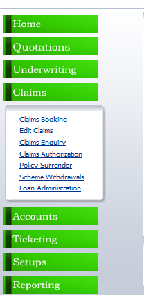

**TURNQUEST LIFE INSURANCE MANAGEMENT SYSTEM (LMS)**

**SYSTEM GROUP BUSINESS TRAINING MANUAL**

**CLAIMS PROCESSING**

**BY**

**TURNKEY AFRICA LTD**

| 0.0 | 21/12/2010 | Initial Training Plan | Lillian   |
|-----|------------|-----------------------|-----------|
| 1.0 | 18/08/2015 | Updated               | Justin    |
| 2.0 | 26/04/2016 | Updated               | Armstrong |
| 3.0 | 15/2/2018  | Updated               | Jeremy    |

**Table of Contents**

[1](#_heading=h.2s8eyo1) <#_heading=h.2s8eyo1>CLAIMS 3

[1.1](#_heading=h.17dp8vu) <#_heading=h.17dp8vu>Claim Booking 3

[1.1.1](#_heading=h.3rdcrjn) <#_heading=h.3rdcrjn>Claim opening 3

[1.1.2](#exgratia-claims) <#exgratia-claims>Exgratia Claims 7

1.2 <#_heading=h.26in1rg>Pension Claims 8

[1.2.1](#_heading=h.lnxbz9) <#_heading=h.lnxbz9>Dispatch Acknowledgement letter 9

[1.2.2](#_heading=h.35nkun2) <#_heading=h.35nkun2>Waiting for Document Task 9

[1.2.3](#_heading=h.1ksv4uv) <#_heading=h.1ksv4uv>Authorize Voucher 10

[1.3](#_heading=h.1t3h5sf) <#_heading=h.1t3h5sf>Edit Claims 12

[1.4](#_heading=h.44sinio) <#_heading=h.44sinio>Claims Enquiry 13

# CLAIMS

The claims functional module provides for the processing of structured payments and losses strictly defined in the TurnQuest by the insurer. The basis of claims processing is current valid details existing the underwriting module during the period the payment is expected or loss occurs.

## Claim Booking

To process a new claim in the system, click on the claims menu, then click on claims booking link, the screen below appears.

### Claim opening

This is used to open a claim and process it

1.  Select **Claim Opening** from the above screen under transaction type.
2.  Select the **product ID** and select the policy number.
3.  Select the member from the member number list of values.
4.  Select the claim type.
5.  Select the claim type cause.
6.  Select the death/disability location if provided.
7.  Enter the claim loss date and the claim report date.
8.  Click on the next button and the screen below is opened.

1.  Like the quotation and underwriting modules, the claims module is also controlled by ticket.
2.  Once on the claims landing screen you next task will be displayed on the screen.
3.  Click on the authorization tab and click on the dispatch acknowledgment letter complete link.

1.  This completes the task and transitions the user to the next task on the claims module.

1.  Click on  under claims booking details.

1.  The screen below opens.

1.  Select if the claim has been admitted and capture the date it was admitted.
2.  Capture the retention limit in percentage if applicable.
3.  If you want to pay the claim in installments enter the instalment details and click on save.

1.  Click on claim admitted to transition to the next ticket.
2.  The next ticket will be .
3.  Click on the required documents tab and the screen below is opened.

1.  This screen is used to update whether the documents required at claims have been submitted.
2.  By default, the document is indicated as not submitted until you select submitted and enter the date submitted or select exempted where the document is not required.
3.  To update a record, select the record and click on the button , the screen below is opened.

1.  Select whether pending, submitted or exempted. If submitted update the date submitted and the document number if provided and save the record.
2.  Once all the records have been updated click on the  which will mark the task as done and transition you to the next task.

1.  Click on the cover types tab, click on the check box under cover types and click on the button, the screen below is opened.

1.  Select the payee and click ok.
2.  Check the cover type again and click on the process button, the claim is processed successfully and the payable amount is displayed as shown below.

1.  If you want to pay a different amount from the one computed by the system, select the cover and click on edit cover button.

1.  Capture the amount you want to pay in the **but pay** field and click on ok.
2.  The system will raise an exception. The exception can be viewed by clicking on the **authorization**\>\>**exceptions** tab.

1.  To authorize the exception, click on **authorize exception** button.
2.  Click on cover types tab.
3.  Check the cover type and click on the, the voucher is processed successfully and the ticket is transitioned to the next task.
4.  Click on the  tab and the view payment voucher button is displayed.

1.  Click on the button and the screen below is opened.

1.  Click on the button under voucher details and a pop-up screen appears to update the dispatch status of the discharge form.

1.  Update the dispatch status and click on the save button.

1.  Click on the button which will close the current task and transition the ticket to the next task which is authorize voucher.
2.  Click on the button which will authorize the voucher and a cheque will be requisitioned in Finance.

1.  Click on the **back to claim** button to take you back to the claims landing screen.
2.  Click on the **authorization** tab once the cheque has been dispatched and click on the  tab which will update the task of cheque dispatch as complete.
3.  Click on the button to authorize and close the claim. The claim is authorized successfully and the status of the claim is updated as closed (settled).

### Exgratia Claims

This is used to capture claims for members whose details were left out of a loaded policy

1.  Initiate a claim as shown previously.
2.  Select exgratia claim if the member name and details had not been provided for that scheme at underwriting for loaded policies.
3.  When selecting a member, the system will prompt you to either edit a member or add a new member. A pop-up screen appears to enter the member details.

1.  Enter the details and save then you will be able to pick the name of the exgratia member from the lov.
2.  Continue processing of claim from the member selection level.

## Edit Claims

1.  Select **Edit claim** from the **Claims menu** item of the **Group life module**

1.  The screen below is opened.

1.  Select the **product**, the **policy** and the **claim no.** Once this is done the other details will appear.
2.  Click on next button which displays the pending ticket for the transaction you were performing before leaving the claims screen.

1.  Click on the process link which takes you to the screen below.

1.  Click on the process button which will take you to the claims landing screen where you can continue to process the claim.

## Claims Enquiry

1.  Select **claims enquiry** from the **Claim menu** item and the screen below appears

1.  Select the product, policy and the claim no. The other details appear by default.
2.  Click on next button and the claims landing screen is opened.

1.  This screen only allows viewing of claims.

## 
