**TURNQUEST Corporate Business**

**SYSTEM USER MANUAL**

**QUOTATION & NEW BUSINESS SETUPS**

Contents

[1 Quotation & New Business](#quotation--new-business)

[1.1 Setup Prerequisites](#_Toc132639430)

[1.1.1 Organization Data](#organization-data)

[1.1.1.1 Organizations](#organizations)

[1.1.1.2 Region](#region)

[1.1.1.3 Branches](#branches)

[1.1.2 Accounts Data](#accounts-data)

[1.1.2.1 Accounts Type](#accounts-type)

[1.1.2.2 Accounts](#accounts)

[1.1.2.2.1 Defining](#defining)

[1.1.3 Clients Data](#clients-data)

[1.1.4 Service Providers Data](#service-providers-data)

[1.1.4.1 Service Provider Types](#service-provider-types)

[1.1.4.2 Service providers](#service-providers)

[1.1.5 Banks](#banks)

[1.1.6 Occupations Data](#occupations-data)

[1.1.6.1 Life Classes](#life-classes)

[1.1.6.2 Occupations](#occupations)

# Quotation & New Business

This is the process by which insurers assess the risks to insure and decide on premium to charge for accepting those risks. The TurnQuest application takes care of new business in three sections.

## Setup Prerequisites

### Organization Data

To be defined in the CRM application

#### Organizations

Strictly loaded prior to usage of the system to maintain data integrity.

#### Region

1.  Select the organization
2.  Click on the region tab.

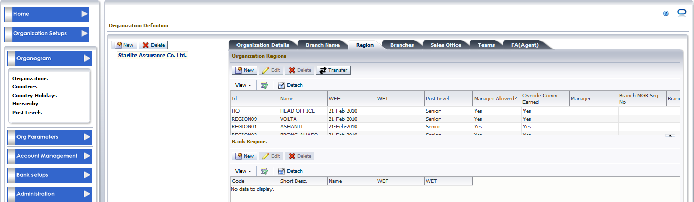

1.  To define new region, click on the new tab

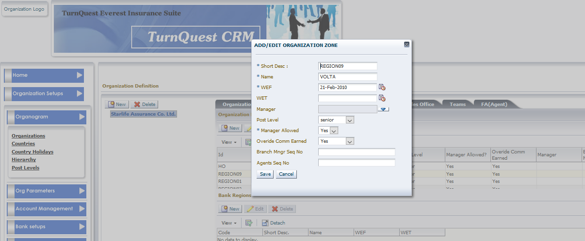

1.  Enter details and save

#### Branches

Click on a region under which to define the branch

Click on the branch tab

Click on the new button to define the branch

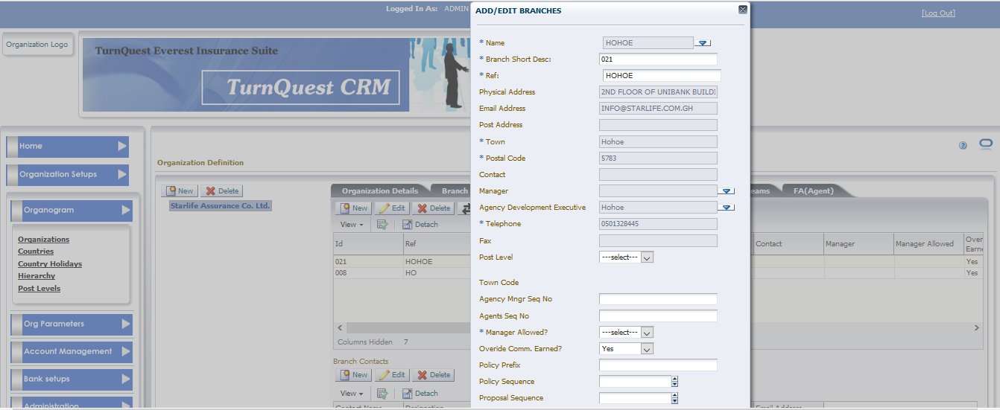

### Accounts Data

To be defined in the CRM applications

Used to define account types and accounts i.e. In-house Agents, Agencies, Brokers, Coinsurance Co, Reinsurance Co, Marketers

#### Accounts Type

Strictly loaded prior to usage of the system to maintain data integrity.

#### Accounts

Used to define the different accounts used during transactions

##### Defining

1.  Click on the accounts menu

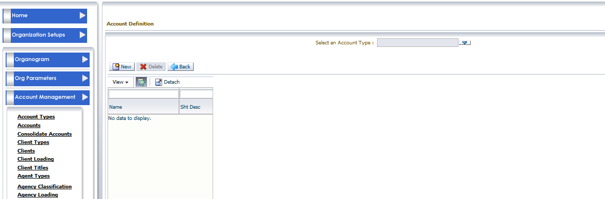

1.  Select the account type, click on new to define a new account

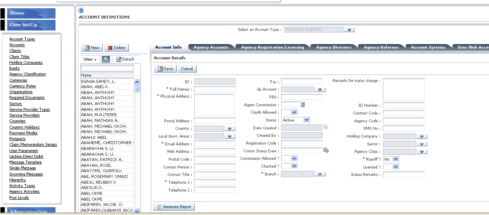

1.  Assign to system once account is saved

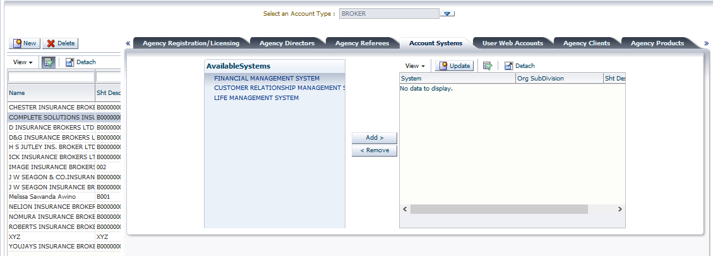

### Clients Data

To be defined in the CRM applications but the system provides a setup shortcut at the transaction point

Used to define clients

1.  Click on the clients’ menu
2.  Click on create/update client tab, select the client type i.e. corporate for group schemes, enter new client details

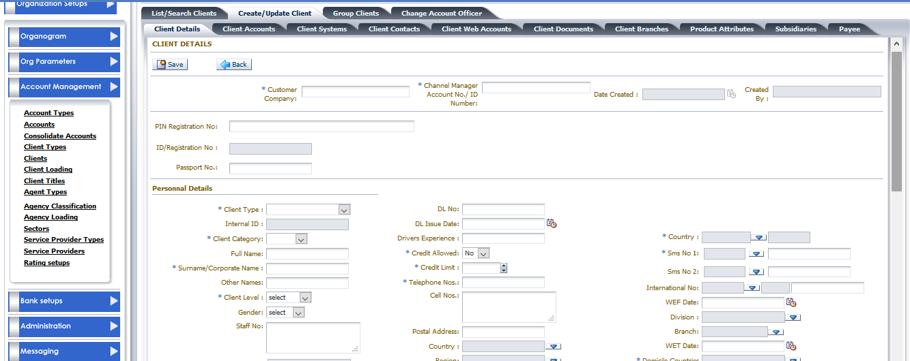

1.  Assign client to the life system

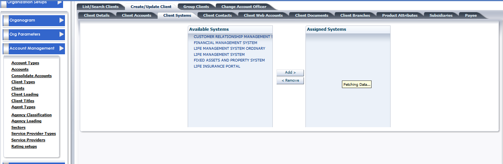

### Service Providers Data

To be defined in the CRM applications

Used to define service provider types and service providers

#### Service Provider Types

Strictly loaded prior to usage of the system to maintain data integrity.

#### Service providers

Used to define Doctors, Hospitals, clinics, doctor etc

1.  Click on service provider menu
2.  Select the service provider type, click on new and define service provider

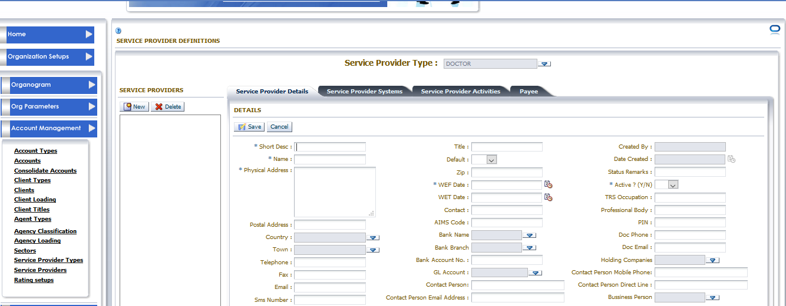

1.  Assign the service provider to system

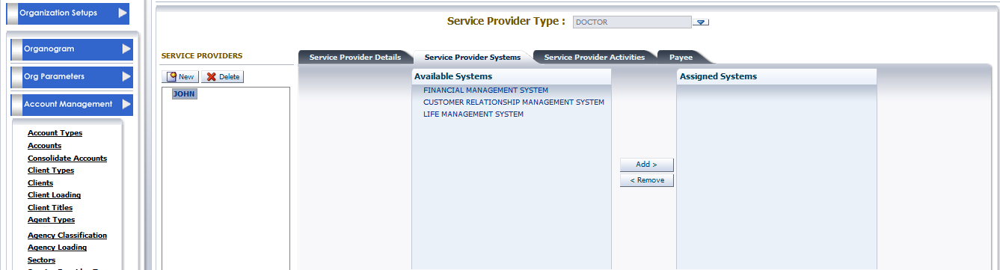

### Banks

Banks are necessary for clients who use Direct Debits, Electronic fund Transfer and bankers order. This data should be provided by finance and can be done through data loading (Data Loading)

### Occupations Data

To be defined in the LMS applications

#### Life Classes

Strictly loaded prior to usage of the system to maintain data integrity.

#### Occupations

1.  Click on setup module
2.  Click the **Group life occupations** sub menu, from the **U/W and Quotation Setup** menu
3.  Click on a class at the **life class occupation block** and click on  to define a new occupation

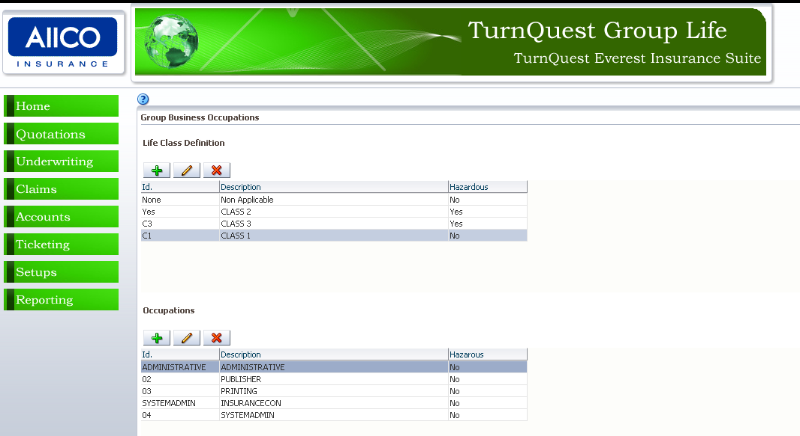