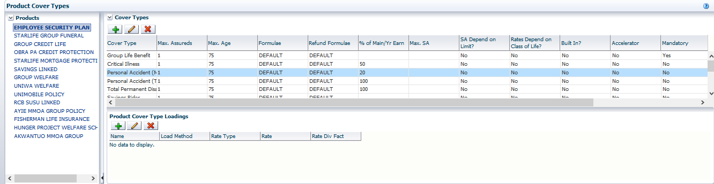
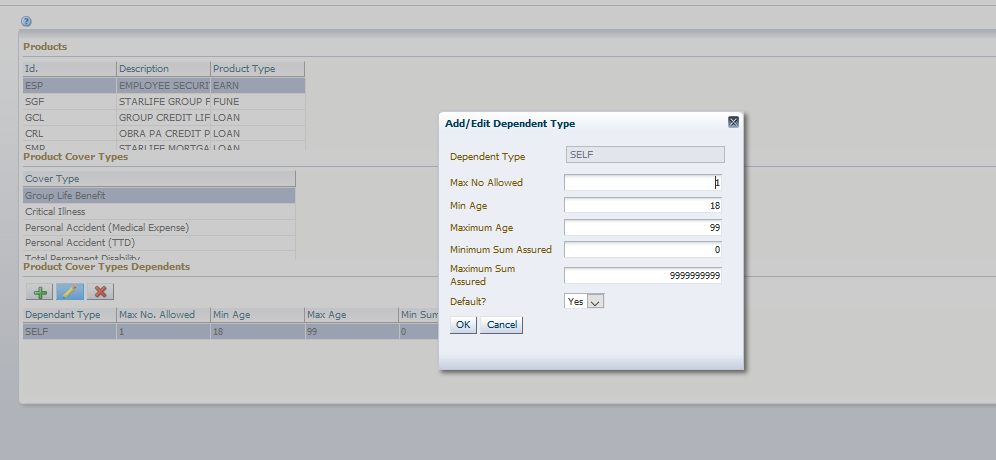

**TURNQUEST LIFE INSURANCE MANAGEMENT SYSTEM (LMS)**

**SYSTEM USER MANUAL**

**QUOTATION & NEW BUSINESS SETUPS**

Contents

[1 Quotation & New Business](#quotation--new-business)

[1.2 Classes and Products Definition](#classes-and-products-definition)

[1.2.1 Product Setup](#product-setup)

[1.2.2 Relation & dependents Type](#relation--dependents-type)

[1.2.3 Cover types definition](#cover-types-definition)

[1.2.4 Product Cover types](#product-cover-types)

[1.2.5 Product Cover Types Dependants](#product-cover-types-dependants)

[1.3 Rates Setup](#rates-setup)

[1.3.1 Premium Structures (Premium Masks)](#premium-structures-premium-masks)

[1.3.2 Premium Rates Loading](#premium-rates-loading)

[1.3.3 Premium Rates](#premium-rates)

[1.3.4 Free Cover Limit Tables](#free-cover-limit-tables)

[1.3.5 Interest rates](#interest-rates)

[1.3.6 Discount types](#discount-types)

[1.3.7 Loading types](#loading-types)

[1.3.8 Claim experience](#claim-experience)

[1.3.9 Short term rates](#short-term-rates)

[1.3.10 Profit share factor](#profit-share-factor)

[1.3.11 Tax types](#tax-types)

[1.3.12 Tax rate by product tax type](#tax-rate-by-product-tax-type)

[1.3.13 Life Premium Commission Rates Definition](#life-premium-commission-rates-definition)

# Quotation & New Business

This is the process by which insurers assess the risks to insure and decide on premium to charge for accepting those risks. The TurnQuest application takes care of new business in three sections.

## Classes and Products Definition

This screen is used to define the classes and products in the life insurance department i.e. Group Life is a product under the Group class of insurance.

Product setup to be illustrated is Group Earnings with investment rider.

### Product Setup

Select **products and classes definition** from the **U/W and quotations setup** menu item of the **Setup Module**

The screen below appears

1.  In the **product definition** tab enter the details associated with the product
    1.  **Product ID**: - Code for the product
    2.  **Description**: -Product Full name
    3.  **Product Type**: - Select Earnings Product.
    4.  **Umbrella product**? – Select No from the drop-down menu.
    5.  **Override Max Entry Age** – Select Yes if you accept members whose age is above the Max age limit set below.
    6.  **Minimum & maximum age limit (years)**: - Age limits for the product.
    7.  **Reinsurance Max Entry Age**: - Maximum age for members accepted by the reinsurer. Leave It blank for group earnings.
    8.  **Minimum & maximum Term** of policy: -Allowed term range for cover
    9.  **Policy Prefix Code**, **Proposal prefix** and **Claim Prefix code**: - short description used in the automated policy, proposal or claim number generation
    10. **Cancellation Notice (days): -** Number of days allowed for a client to notify the insurer before cancelling his or her policy
    11. **Open cover:** – Since earnings is an annual cover select no.
    12. **Default date of birth**: - The date of birth adopted in the event that a client provides only the year of birth.
    13. **Rein Max Period (days)**: - This is the grace period allowed for reinstatement after a policy lapses.
    14. **Is it a loan product**: - Specify whether Sum assured is based on issued loans? Since its not applicable for Earnings products selected No.
    15. **XOL Allowed**: -Select Yes if Excess of loss is allowed at claims processing
    16. **Weekly Indemnity limit**: - Define weekly indemnity payment maximum allowed number of weeks
    17. **Refund Commission**: - Select Yes if refund of commission is allowed on refund of premium transactions.
    18. **Refund allowed**: - Whether refund is allowed on early exit of members
    19. **Initial schedule endorsement allowed**: - used for capturing initial schedule where Aggregate details were used.
    20. **Product covers**: - Specify whether product covers only self, self & dependents, self & joint members or both.
    21. **Partial Cancellation allowed**: - for policies that cover O/S loans to extinction. Select No since it’s not applicable for earnings product.
    22. **Claim Expiry prd (Months): –** The period within which the policy holder is expected to make a claim.
    23. **Quote Expiry Prd (Days):** - The period within which a quote can be converted to a policy.
    24. **Unit rate Applicable:** - Select yes if the one is allowed to input unit rates at underwriting level.
    25. **Applicable lapse type**: - Mode used to lapse i.e. premium only or O/S schedules
    26. **Minimum Multiple of earnings**: - Used for earning products to define minimum multiple of earnings allowed
    27. **Expected schedule receipt date**: - Date when schedules are expected periodically
    28. **Auto generate policy number: -** Select Yes if policy number will be autogenerated by the system based on the set number formats.
    29. **Extension allowed**: - Indicate whether allowed in the event that one wants to postpone renewal
    30. **Renewal allowed**: - Product is renewable
    31. **Schedule adjustment period**: - Period allowed for one to provide corrections on a given schedule
    32. **Profit Share Rate**: - Rate applicable for-profit share computation
    33. **Max Extension period**: - Max days allowed for one to extend cover
    34. **Add/Ref Premium**: - For initial schedule endorsement the allowed add/Ref premium on calculating detailed member premium
    35. **Minimum FCL Members**: - Minimum number allowed for free cover limit
    36. **FCL Max amt**: - Maximum Free cover limit allowed
    37. **FCL Factor \> FCL members**: - Factor applied when members are greater than minimum
    38. **FCL Factor \< FCL members**: - Factor Applied when members are less than minimum allowed
    39. **Remarks**: - Brief description of the products and its benefits
    40. **Policy Document Name**: - Used to define the policy document name for ease in retrieval from the document folder
    41. **Receipting mode**: - select whether you receipt against a debit note or you receipt on policy (cash and carry).
    42. **Status**: - Whether product is active or not.
    43. **Medical Grace period (days)**: - Period within which members with sum assured above FCL are supposed to go for medical tests.
    44. **Catastrophe claims limit**: - maximum number of claims you can make in case of a catastrophe.
    45. **WEF**: - Effective date of the product
    46. **Product organization**- Used to capture the organization the product falls in.
    47. **Pay Multiple payees for main cover**: - Specify whether at claim processing you can pay more than one payee.
    48. **Investment rider allowed**: - Select Yes since its applicable for this product.
    49. **Investment type** – Select the investment type. In this case select *Interest Allocated*.
    50. **EMV calculation type**: - To specify Estimated maturity value calculation type.
    51. **Surr allowed**? – select whether surrender is allowed. Select *NO.*
    52. **Partial Withdrawal -** To capture partial withdrawal details.

1.  **Death acceptable number: -** Used to set allowed claim experience per product

1.  **Premium Fractions: - Annual premium rates factors & Monthly premium rates factor**: - Used to convert annual or monthly rates to the desired premiums based on the frequency of payment

1.  **Schedule reports**: - Used to define schedule reports for a specified product.

1.  **Lapsation**: - Used to define lapse period based on frequency of payment.

1.  **Policy documents**: - Used to define standard policy documents generated for the specified product

1.  **Product Exceptions:** - Notification to be provided in case of condition set for age and sum assured

1.  **Product Experience rate:** - used to capture the maximum claim experience (Experience TLR) ratio at renewal for existing clients over a specified period (Experience Period)

### Relation & dependents Type

**Loaded through initial data script**

This screen is used to define relation and dependents types commonly used in life insurance

Select **relation types** from the **U/W and Quotations Setup** of the **Setup Module**

The screen below appears

1.  To enter a new relation type, click  under the relation types tab, the screen below appears

1.  Enter the ID and the description of the of any expected relation types for the beneficiaries
2.  To enter Dependent types, click new under the dependent types tab. This is for dependants allowed cover alongside the life assured i.e. Spouse, child
3.  The screen below appears

1.  Enter the dependent short description ID and Description

### Cover types definition

This screen is used to capture details for all **product premium items**

1.  Select **Cover types** from the **U/W & quotations setup** menu item of the **Setup Module**
2.  The screen below appears

1.  Click on  to enter a new cover type, the screen below appears

1.  Enter the cover details
-   **Cover ID** - Cover code
-   **Cover Description** - cover type name
-   **Main Cover/Rider** is used to identify whether the cover type is the main cover or a rider.

NB: If the rider sum assured is a percentage of the main cover select *Rider (% of main cover).*

-   **Maximum age** used to indicate the maximum age for a cover type if it differs from that defined at the product level.
-   **Duration Type** represents the cover period. If period is for as long as the member is on cover then select **open** otherwise for covers that are renewed every year select **Annual**
-   **Multiplier** is used to capture the rate applied on the basic SA or basic rate to load or discount the cover type’s SA or rate. The **Division factor** is what is applied to the multiplier
-   **Read from** stands for the rates used in premium computation if stored in a tabular form then select **tables** otherwise pick **other rates**
-   **Rate type** stands for whether the rates used are **monthly rates,** **annual rates or the cover type has both** i.e. For group earnings we use Annual.
-   **Report Name: -** Report generated at policy document when the rider is attached
-   **Pay Beneficiaries**: - Specify whether you can pay beneficiaries at claim processing for this cover.
-   **Occupational benefit** *(Y/N)***: -** specifies whether a cover is occupational benefit payable in the event of death or disability caused at the work place.
-   **Claim max inst. payable:** -Specifies the maximum instalments for claims under the covered. E.g. For dismissal cover once can recover a maximum of six instalments.
-   **Claim waiting period:** - Specifies the maximum period on which the member has to wait after the policy effective date before claiming on the given cover
-   **Constant SA** *(Y/N)* **-** To specify if the cover a constant SA
-   **Constant SA Amt -** Specifies the SA if above (Constant SA) is Y

### Product Cover types

This screen is used to attach cover types to specified products

1.  Select **product cover types definition** from the **U/W & quotation setup menu** item of the **Setup** the screen below appears

1.  Select the product, and click , the screen below appears

1.  Select the cover type attach from a list of values
2.  The details to be captured at this point are those that apply at cover type level based on the product selected
-   **Max Assureds**: The maximum number of people covered
-   **Max Age**: The maximum age allowed for the cover type
-   **Formulae**: For products with premium computation formulae (rate \* SA/div factor). use default rate type
-   **Refund Formulae**: Refund formulae for group products – (rate \* SA/div factor). use default rate type.
-   **% of Main/Yr Earn**: For determining SA for a rider based on basic SA.
-   **Max SA**: Maximum SA allowed
-   **Rates depend on Class of life**: Show those cover types whose rate depends on occupation classes
-   **Built In**: Shows the riders whose premium rate is taken care of in the main cover premium rate
-   **Mandatory: -** The cover type appears on all policies for the selected product
-   **Accelerator:** - The cover type once settled at claims the Sum assured for Main cover is reduced by the settled amount
-   **Group & Single Rate:** - Use of group rates or individual rate per member
-   **Apply 13th Month-** Used for clients who issue bonuses at the end of the year and would like to be covered by the policy.

Attach applicable cover types to the product you created above.

### Product Cover Types Dependants

This screen is used to define **Cover dependants** and their **cover limits**

1.  Select **Product cover type dependants** under the **U/W and quotation setup** of the core setup
2.  The screen below appears

1.  Select the product and cover type, click  to define the dependants, the screen below appears

1.  Specify the Dependant type, maximum allowed for cover, minimum age, maximum age, minimum sum assured and maximum sum assured allowed.

## Rates Setup

### Premium Structures (Premium Masks)

This screen is used to allocate **premium profiles** to a product for easy reading of the premium rates

-   Select **premium mask** from the **U/W & Quotation rates setup** of the **Setup module**, the screen below appears

-   Select the **product** and click on , the screen below appears

-   Enter the details as indicated by the fields. ID, description, rate type and select whether it’s the default mask.
-   Rate types include:
-   Gross rates
-   Pure Rates
-   Mortality Rates
-   Risk premium rates
-   Click on save

### Premium Rates Loading

Used to define loadings for pure rates

-   Select **premium rates loading** from the **U/W & Quotation rates setup** of the **Setup module**, the screen below appears

### Premium Rates

This screen is used to capture the **Group premium rates** setup based on premium mask, cover type dependant, life classes, & age next birthday

1.  Select **premium** **rates** from the **U/W and Quotations rates setup** of **the Setup**, the screen below appears

1.  Select the **product**, the **applicable premium mask**, the **cover type dependant** and **life class.**
2.  Use the  to add premium rate or the **Browse** to import the premium rates from a CSV template. The screen below appears:

Fill in the required fields**:**

1.  **ANB from/To –** age range
2.  **Range From/To –** sum assured range
3.  **Rate –** to capture monthly rates
4.  **Annual rate –** Annual rates
5.  **Single rate – Single payment rate**
6.  **Rate description –** division factor applied to the set rate
7.  **Division factor –** auto populates depending on what you have picked under rate description
8.  **Rate type** – Select the rate type
-   **Fixed rate**: Rate applies across all amounts**.**
-   **Recurring**: The rate is defined for different amounts
-   **Range (Abs):** It is where the amount payable is defined per amount range e.g. 0-10,000 rate applicable is 10%.
-   **Range (step): -** It is where the rate keeps on increasing as the amount increases i.e. for a range of 0-15,000 the rate applicable is 8%, 15,001-25,000 is 10% and so on.
1.  **Prorated/Full –** specify whether the rates are full or prorated
2.  **Multiplier rate -** is used to capture the rate applied on the basic rate to load or discount the rate. The **Division factor** is what is applied to the multiplier
3.  **Constant -** is used to capture a constant applied on the basic rate to load or discount the rate. The **Division factor** is what is applied to the constant.
4.  **Premium applicable at –** specify whether the rate is applicable at normal or refund. Select normal for the earnings product.
5.  **Gender –** specify the gender
6.  **WEF –** specify the date the rate takes effect
7.  Repeat the procedure by selecting all the applicable products, masks, cover type dependant and life class

### Free Cover Limit Tables

1.  Select **Free Cover Limit Factors** from the **U/W and Quotations rates** setup of the **Setup** module, the screen below appears
2.  Select the product and click on  to add new free cover limit factor

### Interest rates

Used to define interest rates used for the investment rider i.e. Estimated maturity value interest.

Select **Interest Rates** from the **U/W and Quotations rates** setup of the **Setup** module, the screen below.

Click on the general interest rates.

To add a new interest rate, click on the  screen below appears

Select the interest type and enter details

### Discount types

Used to capture different discounts types and respective rates applicable at u/w

-   To add a new discount, click (**+ ADD).**
-   The screen below appears (and fill in the details as shown):

### Loading types

Used to capture different discounts types and respective rates applicable at u/w

-   To add a new discount, click (**+ ADD).**
-   The screen below appears (and fill in the details as shown):

### Claim experience

Used to capture the claim experience rate applied on the premium rates at u/w

To capture a new rate click **(+ ADD).**The following screen pops up **:**

-   **Class**:- The class of the claim experience( ie. Is it in class 1)
-   **Claim Exp .Rate from** *(Percentage)*:-The minimum claim experience in the given class
-   **Claim Exp .Rate from***(Percentage)*:- The maximum claim experience in the given class
-   **Claim Exp Class Rate** *(Percentage):-*The rate applied to premium rates for members who fall under this class

### Short term rates

The rates used to calculate premium retained at policy cancellation by the client

To add click **(+ ADD).The following window pops up:**

-   **Rate : -** The rentention premium rate
-   **Rate Division factor***(Percent,per mile)* **: -**  The division factor of the rate
-   **Period from** *(Months)*: - The start month for the application for a given premium retention limit
-   **WEF** :- The start date of the given rate
-   **WET :** - The end date of the given rate

### Profit share factor

Used to define the profit share in the case where the agent and the client are sharing in the profits. Only applicable to certain policies

To add a new click  **(+)** .The following window pops up:

-   **Claim Range From**: - The minimum claim experience (%) from where a certain profit share rate is applicable
-   **Claim Range To**: - The maximum claim experience (%) from where a certain profit share rate is applicable
-   **Client Share**(Percentage): -The percentage of the client’s share in the profits declared
-   **Agent Share**(Percentage): -The percentage of the agent’s share in the profits declared

### Tax types

This screen is used to define the different tax types in the individual life insurance

1.  To view the screen, click on the **Setup** module select the **Tax Types** submenu from the **Tax Definition** menu item. The screen below is opened

1.  Click on the New Button to enter new tax details i.e. **Tax ID** and **description as shown below**

1.  Select the **type** and **applicable** levels which is the point where the tax is computed

### Tax rate by product tax type

This screen is used to define **tax rates** by **product type.** This screen should only be used for taxes that apply to a specific product.

1.  To view the screen, click on the **Setup** module select the **Tax Rates by Product Tax Type** submenu from the **Tax Definition** menu item. The screen is as shown below.

1.  Select the applicable at product level type, if yes select the product
2.  Click on New at Tax Rates, enter the **tax rates** for the selected **tax type** and **product type**
3.  **Range from and Range to**: - for rates that vary with Sum assured
4.  **Age from and Age to**: - Rates that vary with Age else put 0 to 99
5.  **Applied**: - Whether Sum Assured or Premium
6.  **Application Frequency**: - Whether is once or every time the transaction is done
7.  **Tax Duration**: - Period for applying the tax
8.  **Frequency of payment**: - For rates that vary with frequency of payment
9.  Specify the rate type
    1.  **Fixed**: - Rate applied on SA assured
    2.  **Recurring**: - Rate applied per specified range and any amounts thereof
    3.  **Step Range**: - Rate applied based on range of SA i.e. 1st 50000 rates of 2.5, 2nd 50000 rates of 3.5, 3rd 50000 rates of 4.5, rest 5.5
    4.  **Step absolute**: - Rate is selected based SA assured i.e. the absolute amount

### Life Premium Commission Rates Definition

This screen is used to determine the commission rates that apply to the different agents in the system.

1.  To view the screen, go to the **Core Setup** module select **commission rates definition** from the **Agent, broker and reinsurance** menu item submenu.

1.  Select the **product** and the **agent type**.
2.  At Special Rates define the **Rate type,** by clicking on New Button, the **Default rates** are the rates shared by all agents defined under the selected agent type. Any other **rate type** can be defined for agents who have special commission rates defined

1.  Select the **life commission rates tab**; click on the New Button to enter the commission rate, the description; either by percent, per mille, per amount or other (you have to specify in the division factor column for this option)
2.  Division Factor
3.  Specify the rate type
    1.  **Fixed**: - Rate applied on SA assured
    2.  **Recurring**: - Rate applied per specified range and any amounts thereof
    3.  **Step Range**: - Rate applied based on range of SA i.e. 1st 50000 rates of 2.5, 2nd 50000 rates of 3.5, 3rd 50000 rates of 4.5, rest 5.5
    4.  **Step absolute**: - Rate is selected based SA assured i.e. the absolute amount
4.  Specify the **Year No from** and the **Year No to** with respect to the commission rates that apply to each year of premium settlement.
5.  Specify the beginning and the end of the policy term on the columns **policy term from** and **policy term to**.
6.  The **Wef** (With effect from) column specifies the date the policy will come to effect. Therefore, this commission rates will only be applied to policies within the specified date.

