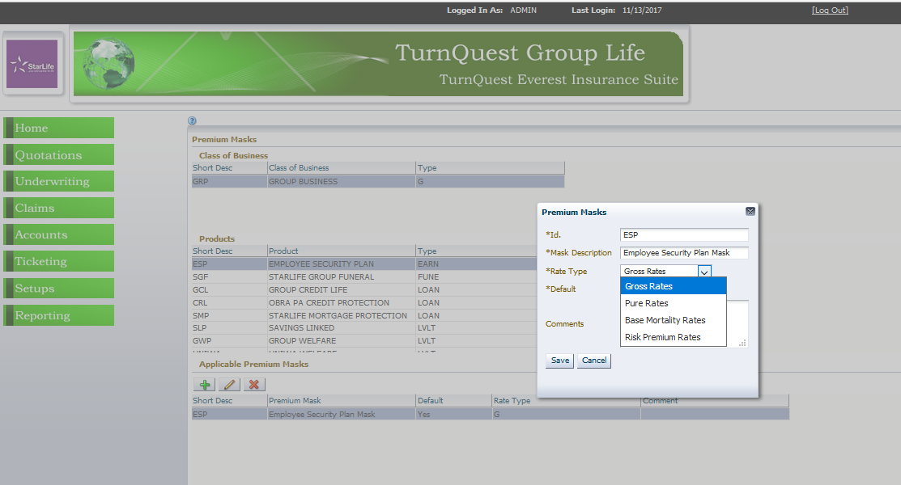
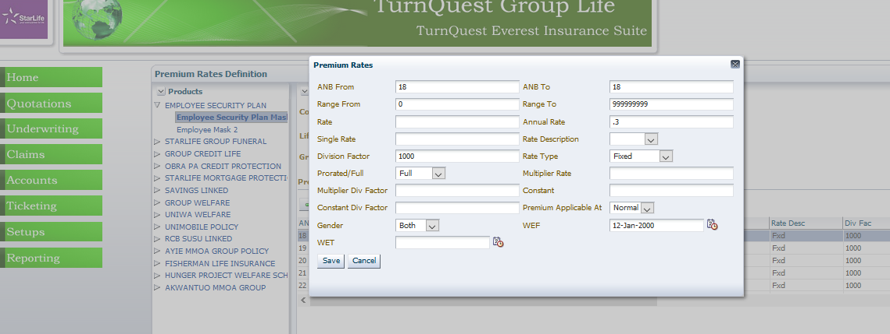
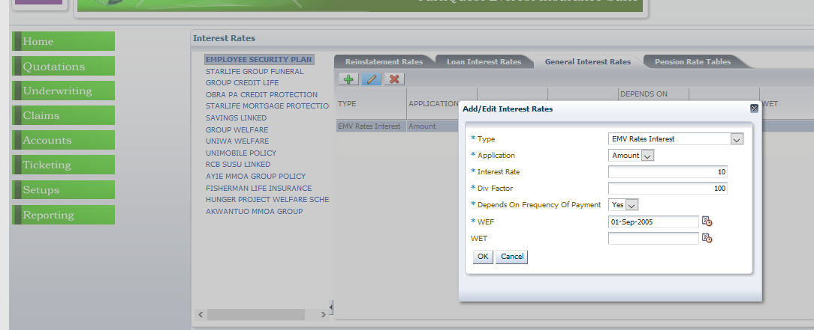
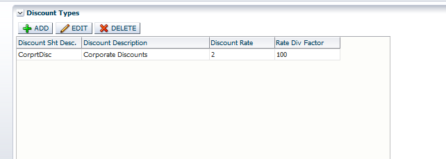
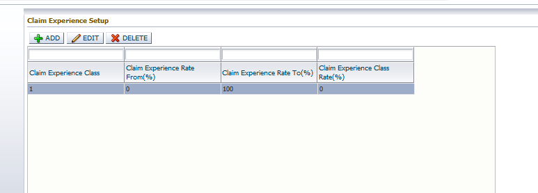
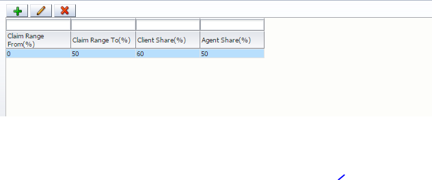
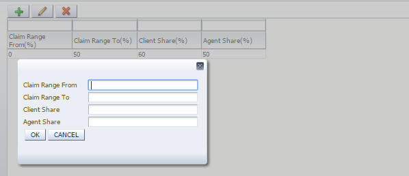
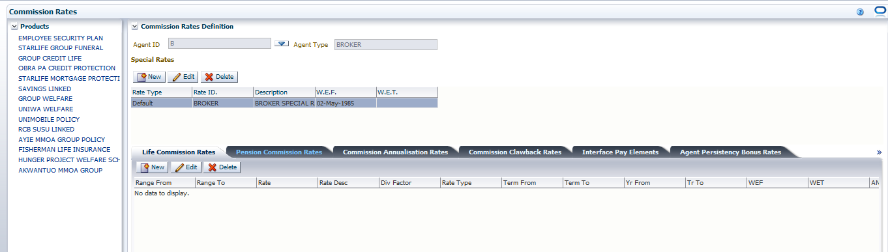
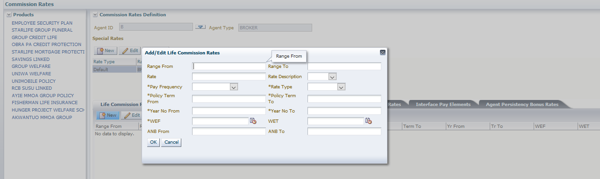

**TURNQUEST LIFE INSURANCE MANAGEMENT SYSTEM (LMS)**

**SYSTEM USER MANUAL**

**QUOTATION & NEW BUSINESS SETUPS**

Contents

[1 Quotation & New Business](#quotation--new-business)

[1.3 Rates Setup](#rates-setup)

[1.3.1 Premium Structures (Premium Masks)](#premium-structures-premium-masks)

[1.3.2 Premium Rates Loading](#premium-rates-loading)

[1.3.3 Premium Rates](#premium-rates)

[1.3.4 Free Cover Limit Tables](#free-cover-limit-tables)

[1.3.5 Interest rates](#interest-rates)

[1.3.6 Discount types](#discount-types)

[1.3.7 Loading types](#loading-types)

[1.3.8 Claim experience](#claim-experience)

[1.3.9 Short term rates](#short-term-rates)

[1.3.10 Profit share factor](#profit-share-factor)

[1.3.11 Tax types](#tax-types)

[1.3.12 Tax rate by product tax type](#tax-rate-by-product-tax-type)

[1.3.13 Life Premium Commission Rates Definition](#life-premium-commission-rates-definition)

# Quotation & New Business

This is the process by which insurers assess the risks to insure and decide on premium to charge for accepting those risks. The TurnQuest application takes care of new business in three sections.

## Rates Setup

### Premium Structures (Premium Masks)

This screen is used to allocate **premium profiles** to a product for easy reading of the premium rates

-   Select **premium mask** from the **U/W & Quotation rates setup** of the **Setup module**, the screen below appears

-   Select the **product** and click on , the screen below appears

-   Enter the details as indicated by the fields. ID, description, rate type and select whether it’s the default mask.
-   Rate types include:
-   Gross rates
-   Pure Rates
-   Mortality Rates
-   Risk premium rates
-   Click on save

### Premium Rates Loading

Used to define loadings for pure rates

-   Select **premium rates loading** from the **U/W & Quotation rates setup** of the **Setup module**, the screen below appears

### Premium Rates

This screen is used to capture the **Group premium rates** setup based on premium mask, cover type dependant, life classes, & age next birthday

1.  Select **premium** **rates** from the **U/W and Quotations rates setup** of **the Setup**, the screen below appears

1.  Select the **product**, the **applicable premium mask**, the **cover type dependant** and **life class.**
2.  Use the  to add premium rate or the **Browse** to import the premium rates from a CSV template. The screen below appears:

Fill in the required fields**:**

1.  **ANB from/To –** age range
2.  **Range From/To –** sum assured range
3.  **Rate –** to capture monthly rates
4.  **Annual rate –** Annual rates
5.  **Single rate – Single payment rate**
6.  **Rate description –** division factor applied to the set rate
7.  **Division factor –** auto populates depending on what you have picked under rate description
8.  **Rate type** – Select the rate type
-   **Fixed rate**: Rate applies across all amounts**.**
-   **Recurring**: The rate is defined for different amounts
-   **Range (Abs):** It is where the amount payable is defined per amount range e.g. 0-10,000 rate applicable is 10%.
-   **Range (step): -** It is where the rate keeps on increasing as the amount increases i.e. for a range of 0-15,000 the rate applicable is 8%, 15,001-25,000 is 10% and so on.
1.  **Prorated/Full –** specify whether the rates are full or prorated
2.  **Multiplier rate -** is used to capture the rate applied on the basic rate to load or discount the rate. The **Division factor** is what is applied to the multiplier
3.  **Constant -** is used to capture a constant applied on the basic rate to load or discount the rate. The **Division factor** is what is applied to the constant.
4.  **Premium applicable at –** specify whether the rate is applicable at normal or refund. Select normal for the earnings product.
5.  **Gender –** specify the gender
6.  **WEF –** specify the date the rate takes effect
7.  Repeat the procedure by selecting all the applicable products, masks, cover type dependant and life class

### Free Cover Limit Tables

1.  Select **Free Cover Limit Factors** from the **U/W and Quotations rates** setup of the **Setup** module, the screen below appears
2.  Select the product and click on  to add new free cover limit factor

### Interest rates

Used to define interest rates used for the investment rider i.e. Estimated maturity value interest.

Select **Interest Rates** from the **U/W and Quotations rates** setup of the **Setup** module, the screen below.

Click on the general interest rates.

To add a new interest rate, click on the  screen below appears

Select the interest type and enter details

### Discount types

Used to capture different discounts types and respective rates applicable at u/w

-   To add a new discount, click (**+ ADD).**
-   The screen below appears (and fill in the details as shown):

### Loading types

Used to capture different discounts types and respective rates applicable at u/w

-   To add a new discount, click (**+ ADD).**
-   The screen below appears (and fill in the details as shown):

### Claim experience

Used to capture the claim experience rate applied on the premium rates at u/w

To capture a new rate click **(+ ADD).**The following screen pops up **:**

-   **Class**:- The class of the claim experience( ie. Is it in class 1)
-   **Claim Exp .Rate from** *(Percentage)*:-The minimum claim experience in the given class
-   **Claim Exp .Rate from***(Percentage)*:- The maximum claim experience in the given class
-   **Claim Exp Class Rate** *(Percentage):-*The rate applied to premium rates for members who fall under this class

### Short term rates

The rates used to calculate premium retained at policy cancellation by the client

To add click **(+ ADD).The following window pops up:**

-   **Rate : -** The rentention premium rate
-   **Rate Division factor***(Percent,per mile)* **: -**  The division factor of the rate
-   **Period from** *(Months)*: - The start month for the application for a given premium retention limit
-   **WEF** :- The start date of the given rate
-   **WET :** - The end date of the given rate

### Profit share factor

Used to define the profit share in the case where the agent and the client are sharing in the profits. Only applicable to certain policies

To add a new click  **(+)** .The following window pops up:

-   **Claim Range From**: - The minimum claim experience (%) from where a certain profit share rate is applicable
-   **Claim Range To**: - The maximum claim experience (%) from where a certain profit share rate is applicable
-   **Client Share**(Percentage): -The percentage of the client’s share in the profits declared
-   **Agent Share**(Percentage): -The percentage of the agent’s share in the profits declared

### Tax types

This screen is used to define the different tax types in the individual life insurance

1.  To view the screen, click on the **Setup** module select the **Tax Types** submenu from the **Tax Definition** menu item. The screen below is opened

1.  Click on the New Button to enter new tax details i.e. **Tax ID** and **description as shown below**

1.  Select the **type** and **applicable** levels which is the point where the tax is computed

### Tax rate by product tax type

This screen is used to define **tax rates** by **product type.** This screen should only be used for taxes that apply to a specific product.

1.  To view the screen, click on the **Setup** module select the **Tax Rates by Product Tax Type** submenu from the **Tax Definition** menu item. The screen is as shown below.

1.  Select the applicable at product level type, if yes select the product
2.  Click on New at Tax Rates, enter the **tax rates** for the selected **tax type** and **product type**
3.  **Range from and Range to**: - for rates that vary with Sum assured
4.  **Age from and Age to**: - Rates that vary with Age else put 0 to 99
5.  **Applied**: - Whether Sum Assured or Premium
6.  **Application Frequency**: - Whether is once or every time the transaction is done
7.  **Tax Duration**: - Period for applying the tax
8.  **Frequency of payment**: - For rates that vary with frequency of payment
9.  Specify the rate type
    1.  **Fixed**: - Rate applied on SA assured
    2.  **Recurring**: - Rate applied per specified range and any amounts thereof
    3.  **Step Range**: - Rate applied based on range of SA i.e. 1st 50000 rates of 2.5, 2nd 50000 rates of 3.5, 3rd 50000 rates of 4.5, rest 5.5
    4.  **Step absolute**: - Rate is selected based SA assured i.e. the absolute amount

### Life Premium Commission Rates Definition

This screen is used to determine the commission rates that apply to the different agents in the system.

1.  To view the screen, go to the **Core Setup** module select **commission rates definition** from the **Agent, broker and reinsurance** menu item submenu.

1.  Select the **product** and the **agent type**.
2.  At Special Rates define the **Rate type,** by clicking on New Button, the **Default rates** are the rates shared by all agents defined under the selected agent type. Any other **rate type** can be defined for agents who have special commission rates defined

1.  Select the **life commission rates tab**; click on the New Button to enter the commission rate, the description; either by percent, per mille, per amount or other (you have to specify in the division factor column for this option)
2.  Division Factor
3.  Specify the rate type
    1.  **Fixed**: - Rate applied on SA assured
    2.  **Recurring**: - Rate applied per specified range and any amounts thereof
    3.  **Step Range**: - Rate applied based on range of SA i.e. 1st 50000 rates of 2.5, 2nd 50000 rates of 3.5, 3rd 50000 rates of 4.5, rest 5.5
    4.  **Step absolute**: - Rate is selected based SA assured i.e. the absolute amount
4.  Specify the **Year No from** and the **Year No to** with respect to the commission rates that apply to each year of premium settlement.
5.  Specify the beginning and the end of the policy term on the columns **policy term from** and **policy term to**.
6.  The **Wef** (With effect from) column specifies the date the policy will come to effect. Therefore, this commission rates will only be applied to policies within the specified date.