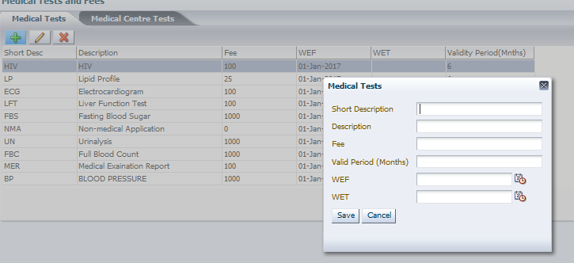

**TURNQUEST LIFE INSURANCE MANAGEMENT SYSTEM (LMS)**

**SYSTEM USER MANUAL**

**QUOTATION & NEW BUSINESS SETUPS**

Contents

[1 Quotation & New Business](#quotation--new-business)

[1.4 Medicals Setups](#_Toc132639467)

[1.4.1 Medical Tests](#medical-tests)

[1.4.2 Facilitator Specific Test Rates](#facilitator-specific-test-rates)

[1.4.3 Medical Groups](#medical-groups)

[1.4.4 Medical requirements](#medical-requirements)

[1.4.5 Provisions](#provisions)

[1.4.5.1 Product Provision](#product-provision)

# Quotation & New Business

This is the process by which insurers assess the risks to insure and decide on premium to charge for accepting those risks. The TurnQuest application takes care of new business in three sections.

## Medicals Setups

### Medical Tests

This screen is used to capture medical tests details

Select **Medical Test** from the **Medical Test Definition** setup of the **Setup** module, the screen below

Select the **Currencies and then Medical tests** submenu across, click on  to add new medical test.

The screen below appears

1.  Enter the **medical description,** **pre-set medical fee, WEF & WET dates and validity period**

### Facilitator Specific Test Rates

Used to define facilitator specific tests

Click on the facilitator tab, click on the LOV  to select the facilitator to update medical test fee.

Click on  to attach a medical test with different fees from the standard rates

### Medical Groups

This screen is used to classify the medical tests into groups

-   To view the screen, click on the **Setup** module under the **Medical test definition** menu select the **medical test groups** option
-   The screen below appears

-   Click currencies and on  under **medical test grouping** to capture a new group

-   Select a group under test group and click on  under group test items to attach the Medical tests

Click on Save to update the record

### Medical requirements

1.  To view this screen, click on the **Setup** menu on the Medical test definition select the **medical requirements** option. The screen below appears

To define a new age range, click on the given currency under currencies and across under requirements, select the product applicable  the screen below appears

1.  Highlight the medical ANB range, click on  button at **requirements** and Enter the Range from and to, which is sum assured, select the medical group then click ok to **save the record,**

1.  Repeat the process until all requirements for the select age range are captured

### Provisions

Used to set up clauses and exclusion i.e. HIV, suicide etc

1.  To view this screen, click on the **Setup** menu on the **Medical test definition** select the **Product Provision** option. The screen below appears

Select the product, click on the **provision details tab**, and click on  at the provisions to add a new provision.

#### Product Provision

This is used to attach the provisions defined to specific products

Select the product, click on the **Product provision details tab**, select the cover type and click on  at the provision to attach the provision.

