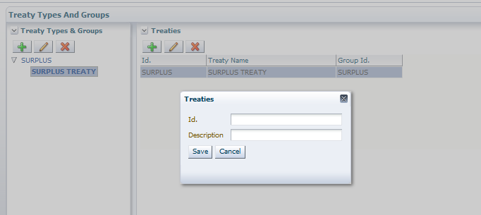

**TURNQUEST LIFE INSURANCE MANAGEMENT SYSTEM (LMS)**

**SYSTEM USER MANUAL**

**QUOTATION & NEW BUSINESS SETUPS**

Contents

[1 Quotation & New Business](#quotation--new-business)

[1.5 Reinsurance Setup](#reinsurance-setup)

[1.5.1 Treaty Types & Treaties](#treaty-types--treaties)

[1.5.2 Treaty Setup](#treaty-setup)

# Quotation & New Business

This is the process by which insurers assess the risks to insure and decide on premium to charge for accepting those risks. The TurnQuest application takes care of new business in three sections.

## Reinsurance Setup

This menu item is used for the setup of reinsurance details i.e. treaty types, treaty arrangements

### Treaty Types & Treaties

1.  To view the screen, click on the **Setup** module select the **Treaties** submenu from the **reinsurance definition** menu item

1.  For the defined types define the **treaty groups**.

### Treaty Setup

This screen is used to setup the **treaty arrangement** for a given **product** for a given **year**

1.  To view the screen, click on the **Setup** module select the **Treaty Setup** submenu from the **reinsurance definition** menu item
2.  The screen below appears

1.  To create a new **treaty arrangement** by clicking on ** under treaties**. The screen below appears. Enter the details as shown below and click ok to save the record

-   ID of the treaty arrangement
    -   Description of the treaty arrangement
    -   **Type** stands for whether the arrangement is based on the:
    -   **Underwriting year** i.e. cede to the treaty based on the year the policy was incepted. The policy is covered by one treaty until maturity.
    -   **Clean Cut**: - Cede to the current treaty irrespective of when the policy was incepted. The risk from policies is passed on to the new arrangement.
1.  Highlight the defined Treaty Arrangement, click on New at the **arrangements** **details** block to define the underwriting year

1.  Define the **underwriting year** and click ok to save
2.  Highlight the Underwriting year then select the **product** at the **classes of business tab. Save the record**

1.  Highlight the product, click on the add button at product cover types tab to attach the product cover types reinsured under the specified arrangement.

1.  Attach the cover type, indicate the insurer’s retention limit
2.  Indicate the amount over which to cede to avoid small ceding
3.  Indicate whether the risk is reinsured on **reducing balance** or **OS balance tables** or **constant SA**
    1.  **Reducing balance: -** Decrease proportional to OS term of cover
    2.  **OS balances tables:** - Tables used to provide rate of OS balance
    3.  **Constant SA:** - Reinsure same amount throughout cover period
4.  Attach **outstanding balance table** if risk is reinsured on **OS balance tables**
5.  Select the **treaty setup tab,** the screen below appears

1.  Click on the New button at the top to define a new treaty for the highlighted year.

1.  Click in the Period from field the **treaty arrangements dates** are picked by default from January to December of the specified year
2.  Specify all the details required click ok to save
3.  Click on the lower New button to attach the participants who should be attached at the **Agent, Broker and reinsurance screen** in **Core Setup**

1.  Select the **treaty cover types,** the screen below appears

1.  At the **Arrangement cover types** click on New and select the cover types for the product specified
2.  Select the **cede type** i.e. Lines, percentage
    1.  **Lines**: - Specified for surplus treaty
    2.  **Percentage**: - Specified for Quota share treaty
3.  Indicate the **cede rate** based on the **cede type**
4.  Select the **rate type** i.e.
1.  **R/I rate** **Tables** for those with rate tables from the reinsurer
    1.  **Premium rates** for those on **original term basis**
    2.  **Cession rates** for those whose **cede rate** is specified as a **percentage**.
1.  **Rate name** is used to specify the Reinsurance rate tables for the cover types whose rate type is **R/I rate table**
2.  **Limit**: - Used to specify the maximum cession amount allowed for the treaty
3.  Highlight the cover type defined Click on the **Commission rates add button**
4.   Define the commission rates per cover type

