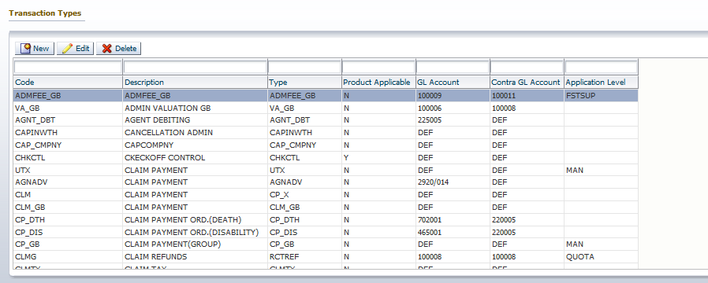

**TURNQUEST LIFE INSURANCE MANAGEMENT SYSTEM (LMS)**

**SYSTEM USER MANUAL**

**QUOTATION & NEW BUSINESS SETUPS**

Contents

[1 Quotation & New Business](#quotation--new-business)

[1.7 Accounts Mapping](#accounts-mapping)

[1.7.1 Transaction Types](#transaction-types)

[1.7.2 Product Transaction Accounts](#product-transaction-accounts)

[1.7.3 Premium Receipting Accounts](#premium-receipting-accounts)

[1.7.4 Reinsurance surplus treaty](#reinsurance-surplus-treaty)

# Quotation & New Business

This is the process by which insurers assess the risks to insure and decide on premium to charge for accepting those risks. The TurnQuest application takes care of new business in three sections.

## Setup Prerequisites

## Accounts Mapping

This module is used to do the mapping for the accounts updated in the financial system when a transaction is authorized in the Group Business system.

### Transaction Types

1.  To view the screen, click in the **Setup** module select the **Accounts Setups** menu item then select the **Transaction Types** submenu, the screen below appears

1.  All transaction types are predefined; the user only needs to update the relevant Accounts code to be updated in the Finance application
2.  To define a new transaction type, click on the New button, the screen below is opened

1.  Select the **GL code** and **contra GL code** (for those that apply) for transactions that are not product applicable (product specific is defined elsewhere)
2.  Select **Type** which is predefined in the application, the system will automatically update the **code**.
3.  The **Description** is provided by the financial/accounting department to identify with the various names given to the items affecting the accounting system.
4.  **Application level**: -Specify whether product applicable or not

### Product Transaction Accounts

If product applicable select the **Accounts** menu item from **Core Setup module** then select the **Product** **Transaction Accounts** submenu, the screen below appears

Use **populate revenue items** button to attach all accounts transactions that are defined as product specific.

To create new account per product, click on the New Button

Select the applicable transaction type, Account no and the control account no if it applies

### Premium Receipting Accounts

The accounts for the transactions below need to be set up before receipting can take place.

NB: - The prerequisite is these accounts should exist in the financial system

1.  DIRECT RECEIPT code type is DR_RCTGB
2.  UNDERWRITING (POLICY) PREMIUM code type is UP_GB
3.  COINSURANCE MEDICAL FEE code type is COIN_MED
4.  COINSURANCE SERVICE CHARGE code type is COIN_SCS
5.  COINSURANCE PREMIUM COMMISSION code type is COIN_COM
6.  COINSURANCE PREMIUM TAX code type is COIN_TAX

### Reinsurance surplus treaty

1.  FIRST SURPLUS REINSURANCE code type is FSTSUP (Select Reinsurance Premium and overwrite the code RP)
2.  FIRST SURPLUS COMMISSION code type is FSTCOMM (Select R/I Commission and overwrite the code RC)
3.  SURPLUS PREMIUM RETAINED code type is FSTPREM (Select RI Retained Premium and overwrite the code RPR)
4.  SURPLUS STAMP DUTY code type is FSTDUTY (Select RI Stamp Duty and overwrite the code RSD)
5.  R/I REINS PREMIUM TAX code type is RPTAX
