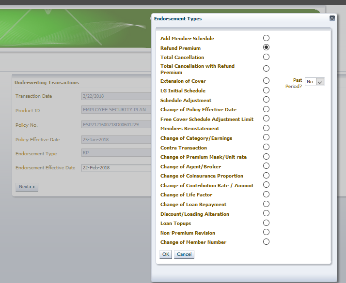
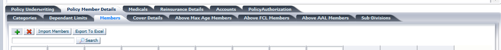
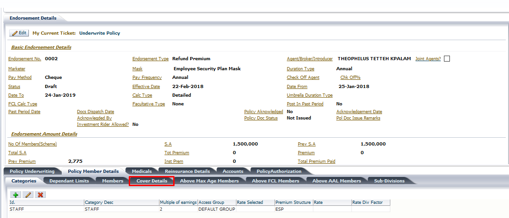
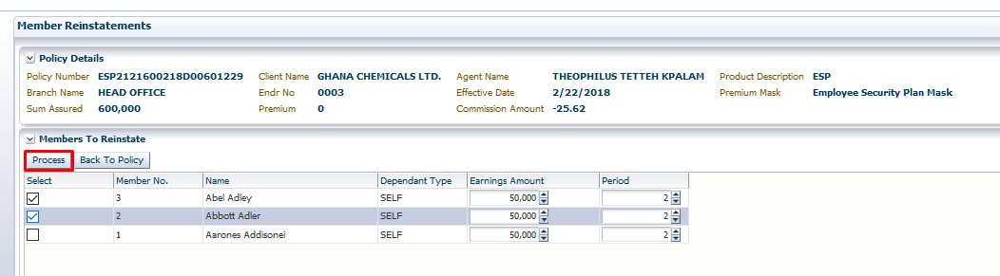
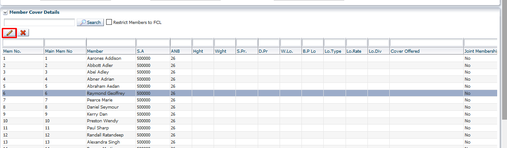
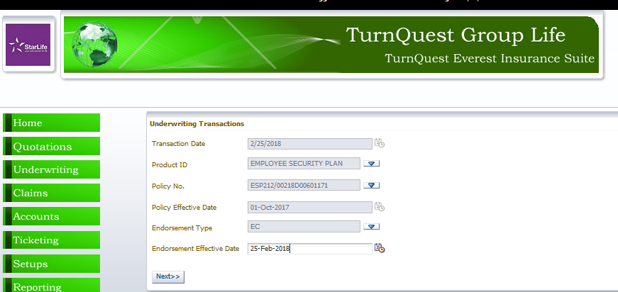
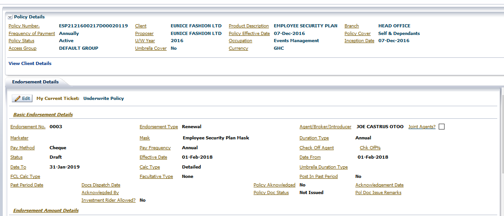
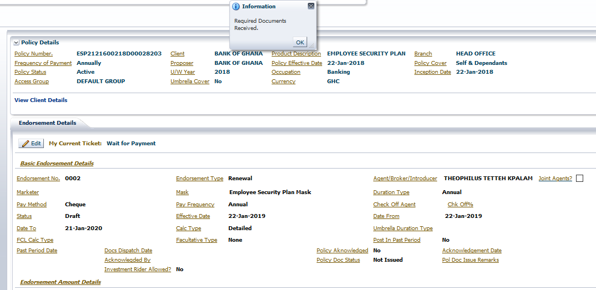

**TURNQUEST LIFE INSURANCE MANAGEMENT SYSTEM (LMS)**

**SYSTEM USER MANUAL**

**POLICY SERVICING PROCESSING**

**TURNKEY AFRICA LTD**

| 0.0 | 21/12/2010 | Initial Training Plan | Lillian   |
|-----|------------|-----------------------|-----------|
| 1.0 | 18/08/2015 | Updated               | Justin    |
| 2.0 | 26/04/2016 | Updated               | Armstrong |
| 3.0 | 20/2/2018  | Updated               | Jeremy    |

[1 POLICY SERVICING](#policy-servicing)

[1.1 Addition of Members](#addition-of-members)

[1.1.1 Group Underwriting Process](#_Toc507318777)

[1.1.1.1 Required documents](#required-documents)

[1.1.1.2 Payments](#payments)

[1.1.1.3 Medical Underwriting](#medical-underwriting)

[1.1.1.4 Group Reinsurance Process](#_Toc507318781)

[1.1.1.5 Group Authorization Process](#_Toc507318782)

[1.2 Removal of Members](#removal-of-members)

[1.2.1 Refund Premium Computation](#refund-premium-computation)

[1.2.2 Make ready](#make-ready)

[1.2.3 Reinsurance processing](#reinsurance-processing)

[1.3 Policy Cancellation](#policy-cancellation)

[1.4 Member Reinstatement](#member-reinstatement)

[1.4.1 Retrieve Members Manually](#retrieve-members-manually)

[1.5 Change of Category/Earnings](#change-of-categoryearnings)

[1.5.1 Change of salary/Earnings](#change-of-salaryearnings)

[1.5.2 Change of Category](#change-of-category)

[1.5.3 Change of both Salary & Category](#change-of-both-salary--category)

[1.6 Change of Premium Mask/Unit Rate](#change-of-premium-maskunit-rate)

[1.6.1 Apply from inception](#apply-from-inception)

[1.6.2 Not applying from inception](#not-applying-from-inception)

[1.7 Schedule Adjustment](#schedule-adjustment)

[1.7.1 Medical loading/restrict to FCL](#medical-loadingrestrict-to-fcl)

[1.8 Change of Agent/Broker](#_Toc507318799)

[1.9 Contra Transactions](#_Toc507318800)

[1.10 Renewals](#renewals)

[1.10.1 Add New Members](#add-new-members)

[Group Life Reinsurance Process](#group-life-reinsurance-process)

[Group Life Authorization Process](#group-life-authorization-process)

[1.10.2 Remove Members](#remove-members)

[1.10.2.1 Required documents](#required-documents-1)

[1.10.2.2 Payments](#payments-1)

[1.10.2.3 Medical Underwriting](#medical-underwriting-1)

[1.10.2.4 Group Reinsurance Process](#group-reinsurance-process-1)

[1.10.2.5 Group Authorization Process](#group-authorization-process-1)

[1.10.3 Export Old Members Update records](#export-old-members-update-records)

[1.10.3.1 Required documents](#required-documents-2)

[1.10.3.2 Payments](#payments-2)

[1.10.3.3 Medical Underwriting](#medical-underwriting-2)

[1.10.3.4 Group Reinsurance Process](#group-reinsurance-process-2)

[1.10.3.5 Group Authorization Process](#group-authorization-process-2)

[1.11 Policy Pension valuation](#_Toc507318817)

[1.11.1 Previous Period Valuation](#_Toc507318818)

[1.11.2 Current Period Valuation](#_Toc507318819)

[1.11.3 Interest distribution](#_Toc507318820)

[1.11.4 Revaluation Refunds](#_Toc507318821)

[1.11.5 Deduction Transaction](#_Toc507318822)

[1.11.6 Reports](#_Toc507318823)

# POLICY SERVICING

This is the process of maintaining policies after the new business process. Policy servicing entails amendments, endorsements and renewals.

## Addition of Members

This entails the addition of new members to an already authorized scheme.

To carry out this transaction.

1.  Select the **Policy Transaction** sub menu from the **underwriting** module
2.  Select the **Endorsements** transaction by clicking the radio button besides it, click on the **Next** Button

1.  The screen below is opened

1.  Select the **product ID, Policy No, endorsement type** and **endorsement effective date**
2.  For endorsement type select **Add Member Schedule** by clicking on the radio button besides it

1.  Click ok, to exit the screen then select the **endorsement effective date**

1.  Click on next the screen below is enabled

1.  Mark the Additional Schedule period i.e. month and year, click on Save. The underwriting screen is opened.

1.  Use the **import member** functionality to add new members. Click on **policy member details\>\>members.**

1.  Click on button to add members one by one. The screen below opens.

    

1.  Capture the member details and click on **save member** or **add another member**.
2.  To import a member template, click on **Import Member** Button the screen below opens

1.  Click on **Download Template** for the CSV file, update it with the client data provided
2.  Click on **Browse**, to import the updated template

1.  The templates used are the same as the New Business templates. **NB:** - **Date Joined** on the template is member specific and should be a date within the policy cover period i.e. Policy effective date and the transaction effective date.

**For Example**: - If Policy Effective date is 1/1/2018 and add member schedule is effective 1/2/20108 the members should have joined between the two dates provided

1.  After loading members click on **Cover Details Tab**, to compute premium for the new members.

1.  Click on **Recompute premium** button the member premiums are updated.
2.  Click on **Back to policy** to go back to main policy.

### Group Underwriting Process

After the process of data entry, premium and FCL computation use ‘Make Ready’ to exit the **Underwrite policy** transaction as indicated by  at the top of the endorsement details screen.

1.  Click on **Policy Authorization**\>\>**Authorization**

1.  At the Authorization tab click on ‘Make Ready’ to finish the underwriting process

#### Required documents

1.  Click on ok, to proceed to the next Task .

    

2.  Click on policy underwriting\>\>required documents
3.  Click on populate required docs tab.
4.  Click on  and mark the documents as either submitted or excempted and then click on .

    

#### Payments

1.  Click on ok, to proceed to the next Task 

    

2.  After receipting in FMS click on Accounts tab to see the receipt. Confirm the amount paid and click on .

#### Medical Underwriting

1.  Click on the  tab to carry out medical requirements

1.  Click on  to view medical populated per member

1.  Click on  to go back to the main screen
1.  Click on  to finalize the medical processing task and generate reports

1.  Click ok, to complete medical process and move to  as show above.

#### Group Reinsurance Process

1.  Click on the  tab

1.  The screen below opens

1.  Click on  to process the arrangement

1.  Click on  to Reinsure back on the current set reinsurance arrangement

1.  Click on  and then to proceed to the next task.

#### Group Authorization Process

Used to finalize new business process

1.  On the exception tab ensure all exceptions are authorized, by clicking on **Authorize Exception**

1.  On the authorization tab click on  to authorize the policy
1.  View the reports as attached and mark them as dispatched by clicking on  once the manual process of delivering to client is done.
1.  The Policy is active and no changes can be done on it but through an endorsement transaction.
2.  For each product **Add Member Schedule** transaction goes through an Underwriting process similar to what there is at **New Business.**
3.  For Micro insurance products there will be no medicals and reinsurance processing.

## Removal of Members

This entails the removal of existing active members from an already authorized scheme.

To carry out this transaction,

1.  Select the **Policy Transaction** sub menu from the **underwriting** module
2.  Select the **Endorsements** transaction by clicking the radio button besides it, click on the **ok**  Button

1.  The screen below is opened

1.  Select the **product ID, Policy No, endorsement type** and **endorsement effective date**
2.  For endorsement type select **Refund Premium** by clicking on the radio button besides it

1.  Click ok, to exit the screen then select the **endorsement effective date**

1.  Click on next the screen below is opened

1.  Click on policy member details \>\> members

    

2.  Highlight the member to remove, Click on  button.

1.  Select and click on next.
2.  Click on .

    

### Refund Premium Computation

1.  The screen below opens.

1.  To compute refund premium, click on **Recompute premium** button

1.  The refund premium is populated as shown above

### Make ready

To finalize the refund premium processing, click on make ready button under policy authorization \>\> authorization

1.  Click on **policy underwriting** \>\> **required documents**.
2.  Click on populate documents.
3.  Edit the documents to mark them as submitted/exempted and then click .

1.  Click ok to **Reinsurance Details.**

### Reinsurance processing

1.  Click on populate treaties, click on reinsure to update the cession

1.  Premium is refunded proportionate to the member refund premium.
2.  Click on and then .
3.  Click on under policy authorization\>\>authorization.

## Policy Cancellation

Used to cancel the policy

1.  **Underwriting \> Policy Transactions \>Endorsements**
    1.  Select the transaction **Total Cancellation** for those without refunds and **Total cancellation with refund** for those that refund premium for unearned premium

1.  The screen below opens

1.  Compute premium. total cancellation with refund will provide refund premium figures.
    1.  Go through the processes as indicated under Removal of member endorsement.
-   Make ready
-   Check for required documents
-   Reinsurance processing - to recover premium
-   Authorize

## Member Reinstatement

1.  Used to reinstate members removed from a policy by mistake.
2.  **Underwriting \> Policy Transactions \>Endorsements**
3.  Select member reinstatement

1.  Click OK, Select the endorsement effective date

1.  Click on next

### Retrieve Members Manually

1.  In the underwriting screen click on policy member details\>\>members

1.  Click on **Members to reinstate** tab, the screen below opens

1.  Select the member to reinstate and click on **process**

1.  Click Back to Policy
2.  Click **members**\>\>**cover** **details** and recompute premium.
3.  Go through the processes as indicated under new business
-   Make ready
-   Check for required documents
-   Payment Received
-   Medical Underwriting
-   Reinsurance processing
-   Authorize Policy

## Change of Category/Earnings

1.  Used to change category, sum assured through update of earnings
2.  **Underwriting \> Policy Transactions \>Endorsements**
3.  Select change of category/earnings as shown below

1.  Click ok, the screen below opens

1.  Click next

1.  Click on Policy member details\>\>members
1.  Highlight the member to be updated, click on change category

1.  Click on change category. The screen below appears

1.  Select the option as shown below.

### Change of salary/Earnings

### Change of Category

1.  Used to change where an employee has been promoted or demoted from a category. The category to change to should have been defined under new business

### Change of both Salary & Category

1.  Used to change both earnings and category

1.  Update the details, Click on Save to go to the underwriting screen

1.  Click on Cover Details Tab, the screen below opens

1.  Recompute premium, premium is computed based on the period of cover after the change

1.  Click Back to Policy
2.  Go through the processes as indicated under new business
-   Make ready
-   Check for required documents
-   Payment Received
-   Medical Underwriting
-   Reinsurance processing
-   Authorize Policy

## Change of Premium Mask/Unit Rate

1.  Used to change premium mask /rate

1.  Click ok, the screen below opens

### Apply from inception

1.  Select the apply type as show above.
2.  If **yes** then, system automatically picks the policy effective date.

1.  Click on next, the policy underwriting screen opens.

    

2.  Click on the  button to change the mask.

    

3.  Choose the premium mask and click on .
4.  Click on **policy member details** \>\> **cover details**.
5.  Click on **recompute premium.** The premium is computed from the effective date of the policy.

1.  Click Back to Policy
2.  Go through the processes as indicated under new business
-   Make ready
-   Check for required documents
-   Payment Received
-   Medical Underwriting
-   Reinsurance processing
    1.  Authorize Policy.

### Not applying from inception

1.  Select **NO** for apply type

1.  Click on next, the policy underwriting screen opens.

    

2.  Click on the  button to change the mask.

    

3.  Choose the premium mask and click on .
4.  Click on **policy member details** \>\> **cover details**.
5.  Click on **recompute premium.** The premium is computed from the endorsement effective date of the policy.

1.  Click Back to Policy
2.  Go through the processes as indicated under new business
-   Make ready
-   Check for required documents
-   Payment Received
-   Medical Underwriting
-   Reinsurance processing
    1.  Authorize Policy.

## Schedule Adjustment

1.  Used to make changes to schedule details from inception i.e. Salary, Age, Category etc.

    Also used for Medical loading or restricting to FCL for members who were sent for medicals

1.  click on **ok**, pick the effective date and click **next**

1.  Click on policy member details\>\> members

    

2.  Click on import members

1.  Click on **Download Template** for the CSV file, update it with the client data provided
2.  Click on **Browse**, to import the updated template

1.  The templates used are the same as the New Business templates.

1.  Back to policy, click on Cover Details tab

Recompute premium, Click Back to Policy

Go through the processes as indicated under new business

-   Make ready
-   Check for required documents
-   Payment Received
-   Medical Underwriting
-   Reinsurance processing
-   Authorize Premium

### Medical loading/restrict to FCL

1.  Highlight member and click on the edit link

1.  Update the medical details, load type

1.  select cover offered

1.  click ok
2.  Recompute premium, Click Back to Policy
3.  Go through the processes as indicated under new business
-   Make ready
-   Check for required documents
-   Payment Received
-   Medical Underwriting
-   Reinsurance processing
-   Authorize policy

## Change of Agent/Broker

1.  Select the **Policy Transaction** sub menu from the **underwriting** module
2.  Select the **Endorsements** transaction by clicking the radio button besides it, click on the **Next** Button

    

3.  The screen below is opened.

    

4.  Select the **product ID and Policy No**
5.  For endorsement type select **Change of Agent/Broker** by clicking on the radio button besides it

    

6.  Click ok and the select whether its initiated by client or underwriter.

    

1.  If you select initiated by the client you will select whether to apply the endorsement from inception, commission payment basis and effective date.
2.  If you select initiated by underwriter those fields will be auto populated as shown below.

    

3.  Click on the next button, the underwriting screen is opened with endorsement type change of Agent/Broker displayed.

1.  Click on 

    

2.  Click the agents list of values and a list of the available agents is displayed.

    

3.  Select the new agent and click on the save button.
4.  Click on the authorization tab and click on the make ready button.
5.  Check for required documents.
6.  Click on the authorize button, the change of agent endorsement is updated successfully.

## Extension of cover

This endorsement is done in the event that one wants to postpone renewal. The extension maximum period is set at product setup level.

1.  To carry out this transaction, select the **Policy Transaction** sub menu from the **underwriting** module
2.  Select the **Endorsements** transaction by clicking the radio button besides it, click on the **Next** Button

1.  The screen below is opened

1.  Select the **product ID, Policy No, endorsement type** and **endorsement effective date**
2.  For endorsement type select **Extension of cover** by clicking on the radio button besides it

1.  Click ok, to exit the screen then select the **endorsement effective date**

1.  Click on next the screen below is enabled

1.  Capture the New cover to date and click on Save. The underwriting screen is opened.

1.  Click on **Cover Details Tab**, to compute premium for the new members.

1.  Click on **Recompute premium** button the member premiums are updated.
2.  Click on **Back to policy** to go back to main policy.

### Group Underwriting Process

After the process of data entry, premium and FCL computation use ‘Make Ready’ to exit the **Underwrite policy** transaction as indicated by  at the top of the endorsement details screen.

1.  Click on **Policy Authorization**\>\>**Authorization**

1.  At the Authorization tab click on ‘Make Ready’ to finish the underwriting process

#### Required documents

1.  Click on ok, to proceed to the next Task .

    

2.  Click on policy underwriting\>\>required documents
3.  Click on populate required docs tab.
4.  Click on  and mark the documents as either submitted or excempted and then click on .

    

#### Payments

1.  Click on ok, to proceed to the next Task 

    

2.  After receipting in FMS click on Accounts tab to see the receipt. Confirm the amount paid and click on .

#### Group Reinsurance Process

1.  Click on the  tab

1.  The screen below opens

1.  Click on  to process the arrangement

1.  Click on  to Reinsure back on the current set reinsurance arrangement

1.  Click on  and then to proceed to the next task.

#### Group Authorization Process

Used to finalize new business process

1.  On the exception tab ensure all exceptions are authorized, by clicking on **Authorize Exception**

1.  On the authorization tab click on  to authorize the policy
1.  View the reports as attached and mark them as dispatched by clicking on  once the manual process of delivering to client is done.
1.  The Policy is active and no changes can be done on it but through an endorsement transaction.

## Contra Transactions

1.  Select the **Policy Transaction** sub menu from the **underwriting** module
2.  Select the **Endorsements** transaction by clicking the radio button besides it, click on the **Next** Button

    

3.  The screen below is opened.

    

4.  Select the **product ID and Policy No**
5.  For endorsement type select **Contra Transaction** by clicking on the radio button besides it

    

6.  Select endorsement effective date and the transaction to contra from the old transaction list.

    

1.  Click on the next button

    

2.  The underwriting screen is opened with endorsement type contra transaction displayed.

    

3.  Click on make ready on the authorization tab to complete the underwriting task.

    

4.  Check for the required documents.
5.  Click on the authorize button, the contra endorsement is authorized successfully and the selected transaction is reversed.

## Renewals

1.  Select the **Renewals Processing** link from the **underwriting** module

1.  Select the product, client, policy number, date from and date to then click on search.
2.  The policy due for renewal is populated.

    

3.  Click on renew policy, the screen below opens.

    

4.  Capture the cover from date and click on next.

    

### Add New Members

1.  Click policy member details\>\>cover details the screen below appears.

    

2.  To import new members, click on the screen below appears.

    

3.  Click on browse, to open the applicable template and upload the file.

    

4.  Click on **back to policy**.
5.  After loading members click on **Recompute Premium**, to compute premium for all the members.
6.  Click on .
7.  Click on ‘Make Ready’ from **Policy authorization**\>\>**authorization** to exit the **Underwrite policy** transaction.

1.  Click on ok, to proceed to the next Task 
2.  Click on **policy underwriting**\>\>**required documents.**
3.  Click on populate documents and the edit to mark the documents as either submitted or exempted.
4.  Click on 
5.  After receipting in FMS click on the  tab to view the receipt and then click on .

##### Medical Requirements Process

1.  Click on the  tab to carry out medical requirements

1.  Click on  to view medical populated per member

1.  Click on  to go back to the main screen
1.  Click on  to finalize the medical processing task and generate reports

1.  Click ok, to complete medical process and move to  as show above.

#### Group Life Reinsurance Process

1.  Click on the  tab

1.  The screen below opens

1.  Click on  to process the arrangement

1.  Click on  to Reinsure back on the current set reinsurance arrangement

1.  Click on  and then to proceed to the next task.

#### Group Life Authorization Process

Used to finalize the renewal process

1.  On the exception tab ensure all exceptions are authorized, by clicking on **Authorize Exception**

1.  On the authorization tab click on  to authorize the policy
1.  View the reports as attached and mark them as dispatched by clicking on  once the manual process of delivering to client is done.
1.  The Policy is active and no changes can be done on it but through an endorsement transaction.
2.  For Micro insurance products there will be no medicals and reinsurance processing.

### Remove Members

1.  To remove and Import afresh a template provided by the client for renewal, Select the box ‘**Delete Existing Main Benefit’** from cover details screen.

    

2.  Click on import member’s button. On Import Members button, the existing member cover at this renewal will be removed and system allows loading of a new schedule

    

3.  Click on browse, to open the applicable template

    

4.  Click on After loading members and click on **Recompute Premium**, to compute premium for the new members.
5.  Click on and then click on ‘**Make Ready’** from policy authorization \>\> authorization to exit the **Underwrite policy** transaction.
6.  At the Authorization tab click on ‘Make Ready’ to finish the underwriting process.

#### Required documents

1.  Click on ok, to proceed to the next Task .

    

2.  Click on policy underwriting\>\>required documents
3.  Click on populate required docs tab.
4.  Click on  and mark the documents as either submitted or excempted and then click on .

    

#### Payments

1.  Click on ok, to proceed to the next Task 

    

2.  After receipting in FMS click on Accounts tab to see the receipt. Confirm the amount paid and click on .

#### Medical Underwriting

1.  Click on the  tab to carry out medical requirements

1.  Click on  to view medical populated per member

1.  Click on  to go back to the main screen
1.  Click on  to finalize the medical processing task and generate reports

1.  Click ok, to complete medical process and move to  as show above.

#### Group Reinsurance Process

1.  Click on the  tab

1.  The screen below opens

1.  Click on  to process the arrangement

1.  Click on  to Reinsure back on the current set reinsurance arrangement

1.  Click on  and then to proceed to the next task.

#### Group Authorization Process

Used to finalize new business process

1.  On the exception tab ensure all exceptions are authorized, by clicking on **Authorize Exception**

1.  On the authorization tab click on  to authorize the policy
1.  View the reports as attached and mark them as dispatched by clicking on  once the manual process of delivering to client is done.
1.  The Policy is active and no changes can be done on it but through an endorsement transaction.

### Export Old Members Update records

1.  To update existing members earnings and change category click export member earnings template from **policy member details\>\>cover details**

    

2.  Click on utilities to export the member details to excel.

    

3.  Once in excel you can update earnings, category and indicate if the member is removed.
4.  Once this is done save and re import the template by clicking on .

    

5.  Click on **back**.
6.  Click on the recompute premium button.
7.  Click on and then click on ‘**Make Ready’** from policy authorization \>\> authorization to exit the **Underwrite policy** transaction.
8.  At the Authorization tab click on ‘Make Ready’ to finish the underwriting process.

#### Required documents

1.  Click on ok, to proceed to the next Task .

    

2.  Click on policy underwriting\>\>required documents
3.  Click on populate required docs tab.
4.  Click on  and mark the documents as either submitted or excempted and then click on .

    

#### Payments

1.  Click on ok, to proceed to the next Task 

    

2.  After receipting in FMS click on Accounts tab to see the receipt. Confirm the amount paid and click on .

#### Medical Underwriting

1.  Click on the  tab to carry out medical requirements

1.  Click on  to view medical populated per member

1.  Click on  to go back to the main screen
1.  Click on  to finalize the medical processing task and generate reports

1.  Click ok, to complete medical process and move to  as show above.

#### Group Reinsurance Process

1.  Click on the  tab

1.  The screen below opens

1.  Click on  to process the arrangement

1.  Click on  to Reinsure back on the current set reinsurance arrangement

1.  Click on  and then to proceed to the next task.

#### Group Authorization Process

Used to finalize new business process

1.  On the exception tab ensure all exceptions are authorized, by clicking on **Authorize Exception**

1.  On the authorization tab click on  to authorize the policy
1.  View the reports as attached and mark them as dispatched by clicking on  once the manual process of delivering to client is done.
1.  The Policy is active and no changes can be done on it but through an endorsement transaction.
