**TURNQUEST LIFE INSURANCE MANAGEMENT SYSTEM (LMS)**

**SYSTEM GROUP BUSINESS TRAINING MANUAL**

**CLAIMS SETUP**

**BY**

**TURNKEY AFRICA LTD**

| 0.0 | 21/12/2010 | Initial Training Plan | Lillian   |
|-----|------------|-----------------------|-----------|
| 1.0 | 18/08/2015 | Updated               | Justin    |
| 2.0 | 26/04/2016 | Updated               | Armstrong |
| 3.0 | 15/2/2018  | Updated               | Jeremy    |

Table of Contents

[1 Claims setup](#claims-setup)

[1.1 Claim No Format](#claim-no-format)

[1.2 Policy Cancellation Setup](#policy-cancellation-setup)

[1.3 Claims causation](#claims-causation)

[1.4 Claim Causes](#claim-causes)

[1.5 Claims Causations causes](#claims-causations-causes)

[1.6 Non Medical Claims](#non-medical-claims)

[1.7 Claims Product Cover types Causations](#claims-product-cover-types-causations)

[1.8 Required Policy Documents](#required-policy-documents)

[1.9 Pension Claims tax exempt amount](#_Toc428387654)

[1.10 Employer Withheld Fund](#_Toc428387655)

[1.11 Annuity factors for Pension](#_Toc428387656)

[1.12 Claims Taxes](#_Toc428387657)

[1.13 Financial Account types](#financial-account-types)

# Claims setup

The claims functional module provides for the processing of structured payments and losses strictly defined in the TurnQuest by the insurer. The basis of claims processing is current valid details existing the underwriting module during the period the payment is expected or loss occurs and the allowed causations defined in the system.

The setups expected for claims processing are

## Claim No Format

The system shall allow setup of claim number formats to allow generation of the claim number in the desired format per product. In claim number format the varying parameters required are provided for the user to assemble in the required format. The varying parameters provided are branch code, agency code, unit code, separator type, underwriting year, product code and product claim sequence etc

1.  Login into LMS Group application
2.  Click on **number formats** from the **company parameters link** of the **Setup Menu**

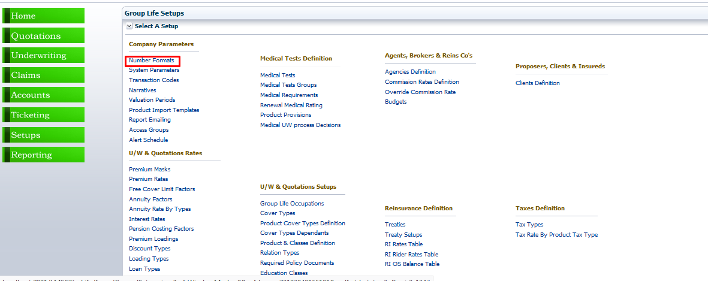

1.  The screen below opens

    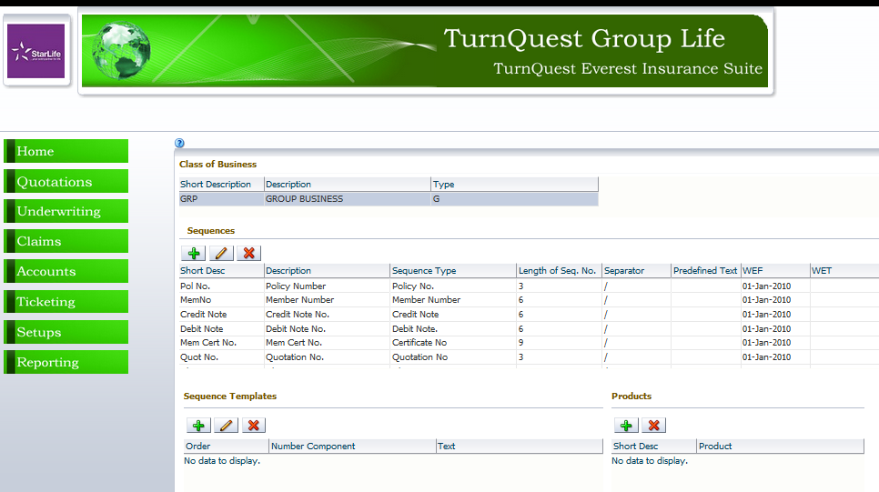

2.  Highlight the class of business
3.  Click on the add button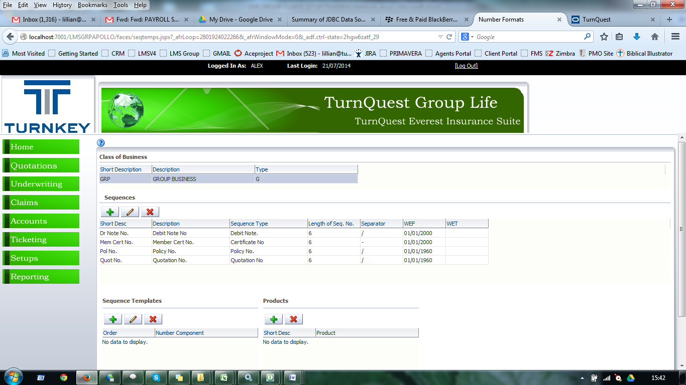 at the Sequences level, the screen below opens

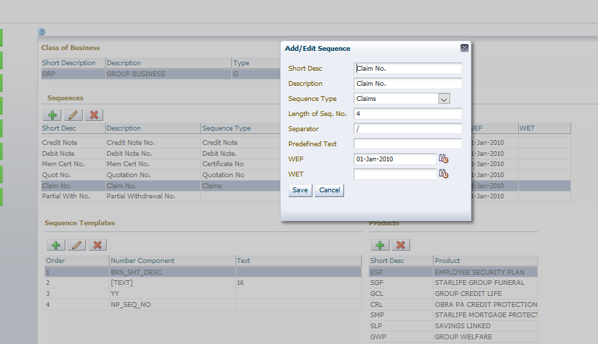

1.  Capture the details and click on save
2.  Highlight the saved record

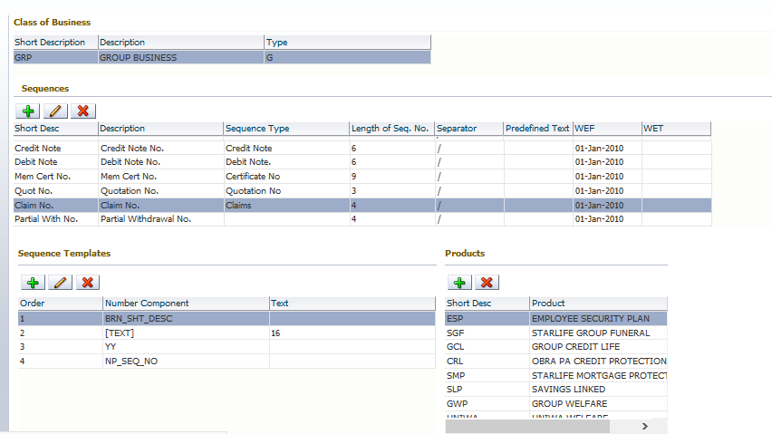

1.  Click on the  at the **sequence templates,** capture the parameters in the desired order

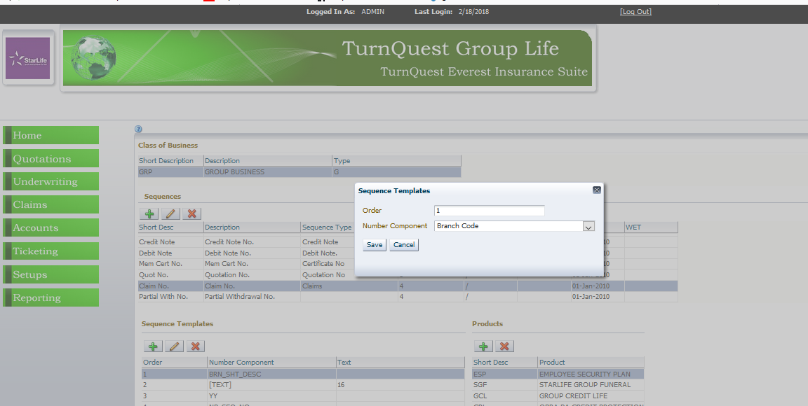

1.  Assign the format to the products applicable, click on  at the products tab. Select the product and click on save

    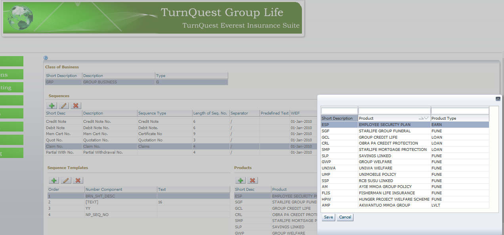

## Policy Cancellation Setup

The system shall allow the setup of the policy cancellation parameters. The parameters are

-   Cancellation Charges -Define the cancellation admin charge rate to be computed when a policy is cancelled.
1.  Select the **interest rates** link from the **U/W & Quotations Rates** section from the **setups** menu.
2.  Highlight the product, click on the General Interest Rates tab, click on new button
3.  Then select the **cancellation Admin Charge** type

    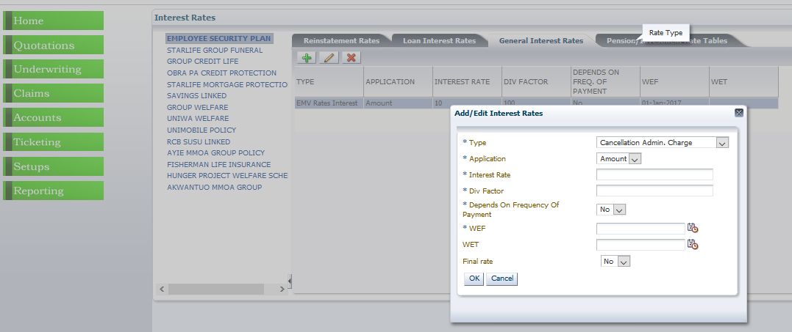

    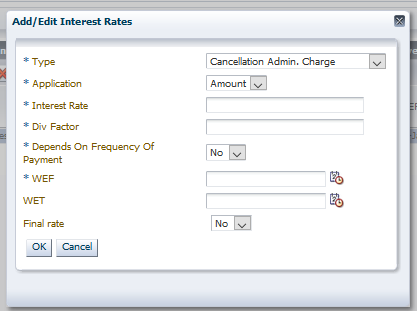

4.  Capture the
    1.  Type: - Cancellation Admin Charge
    2.  Application; - Whether amount or others(Rate)
    3.  Interest rate or amount
    4.  Division Factor
    5.  Depends on Frequency of Payment Y or N
    6.  WEF date
    7.  WET date
    8.  Final rate – set this as No.
5.  Click on Save

## Claims causation

The system shall allow setup of claims causation specified by the insurer. These are loss types allowed for a claim to be paid. The causations types catered for are

-   Death
-   Disability

Strictly loaded prior to usage of the system to maintain data integrity (Initial Data Script.sql)

1.  Select **Causations and causes** link from the **claims setup** menu of the **setup** module

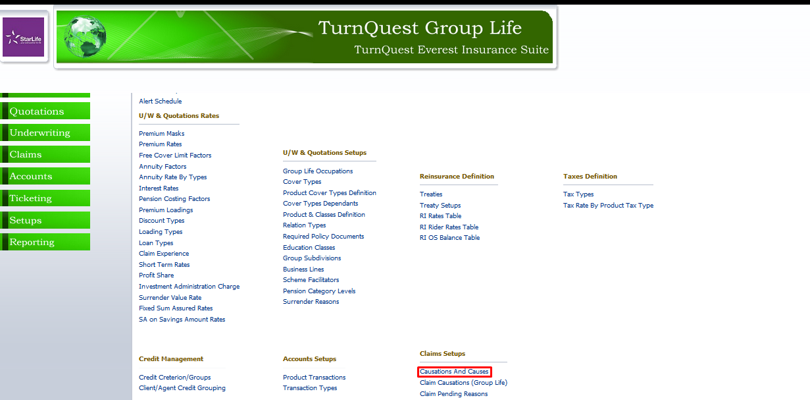

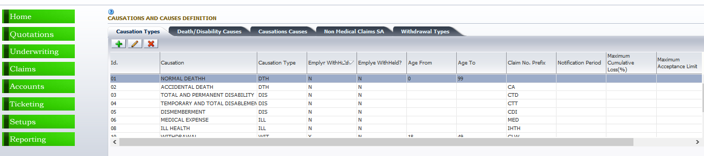

## Claim Causes

The system shall allow setup of causation causes with cause type that allows capturing of claims exclusions

These are loaded but users can add others as the need arises

1.  Select **Causations and causes** link from the **claims setup** menu of the **setup** module
2.  The screen below is opened

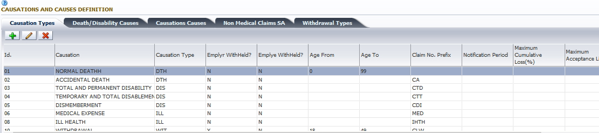

1.  Click on the Death/Disability Causes Tab

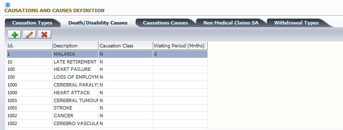

1.  Click on the  button to add a new causation cause

1.  Capture the details
-   **ID**
-   **Cause Description**
-   **Causation Class**: - Caters for Exclusions i.e. HIV but default is **Natural**
-   **Waiting Period**: - For causes that provide for a confirmation waiting period before a payment can be processed
1.  Click on Ok to save

## Claims Causations causes

The system shall allow setup of causations causes.

1.  Select **Causations and causes** link from the **claims setup** menu of the **setup** module
2.  The screen below is opened

1.  Click on the **Causation Causes** Tab, the screen below opens

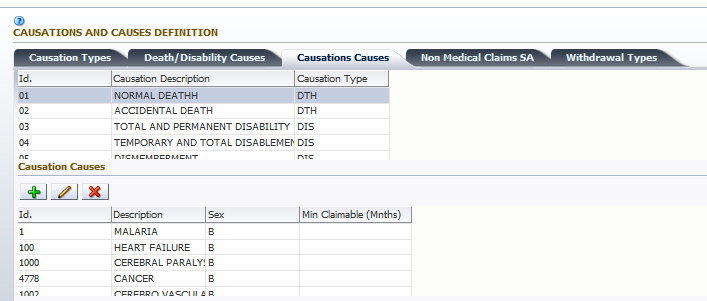

1.  To attach highlight the causation, at the causation causes level, click on the  add Button & select the cause ID to update

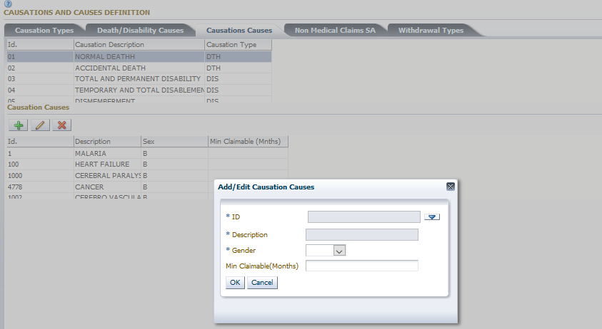

1.  Add the rest of the details, as applicable

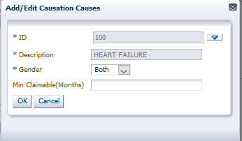

## Non-Medical Claims

This is the claims payment structure for policies with non-medicals policies where the life assured opts not to undergo medical tests.

1.  Select **Causations and causes** link from the **claims setup** menu of the **setup** module
2.  The screen below is opened

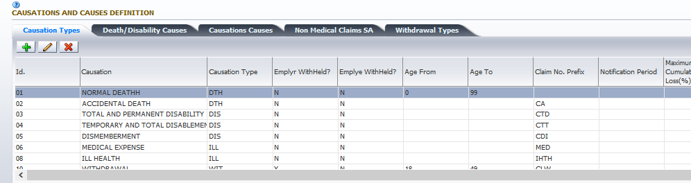

1.  Click on the **Non-Medical Claims SA** Tab, the screen below opens

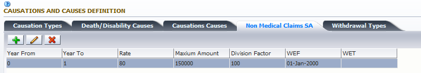

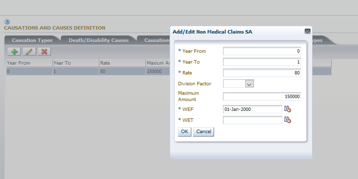

-   **Year From and Year To**: -Year of policy cover period
-   **Rate**: - Claim amount payable rate
-   **Maximum Amount**: - Maximum payable amount, mostly subject to the free cover limit
-   **Division Factor**: - For the rate
-   **WEF and WET**: - With effect from date and with effect to date
1.  Click on ok button to store the record and capture any other rates.

## Claims Product Cover Types Causations

The system shall allow setup of cover type causations which only enables one to process the allowed loss types attached the cover type.

1.  Select **Claim** **Causations** link from the **claims setup** menu of the **setups** module

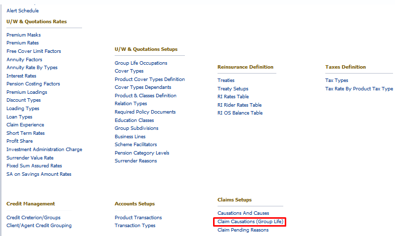

1.  The screen below opens

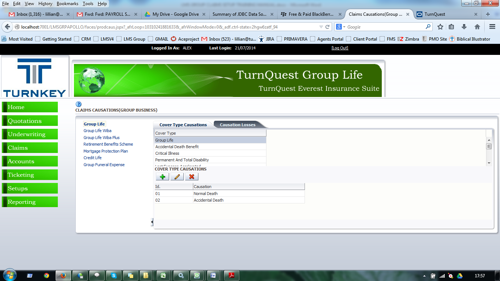

1.  Highlight the product, select the cover type, click on the add button
2.  The screen below opens

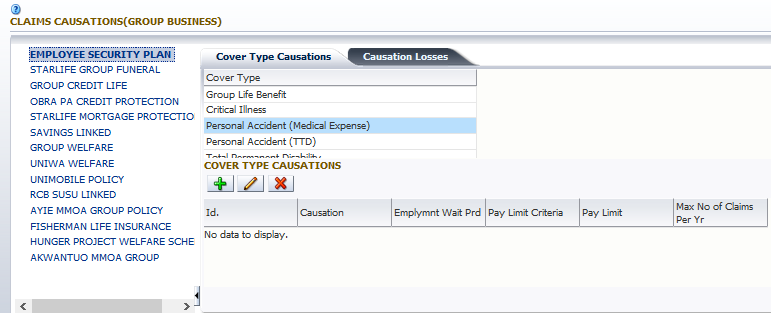

Select the causations applicable for the product cover type & click on ok to save

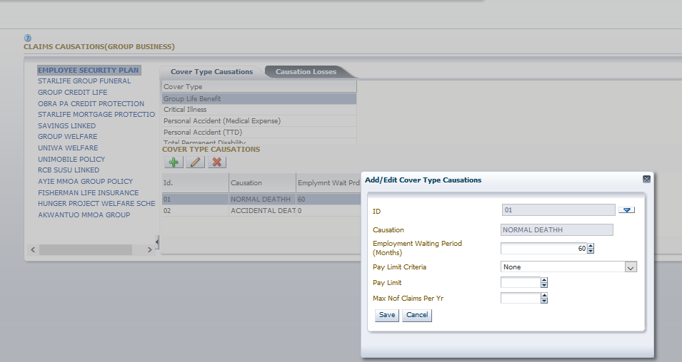

## Required Policy Documents

The system shall allow setup of documents required for the claim process and need to be tracked by the system. The documents required at claims can be policy document, claim form, police abstract, doctor’s report etc

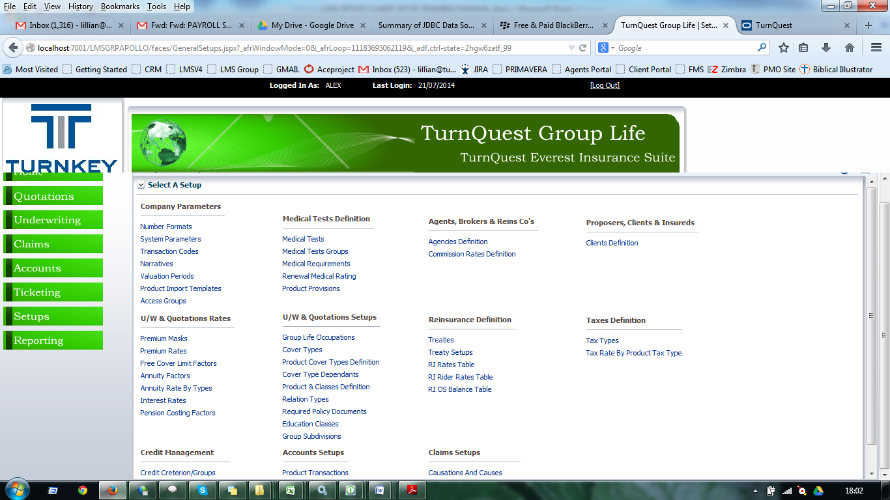

1.  Select the **Required Policy Documents** link from the **U/W & Quotations Setup** section from the **Setups** menu.

    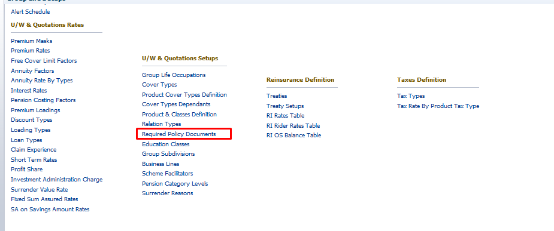

2.  The screen below is opened

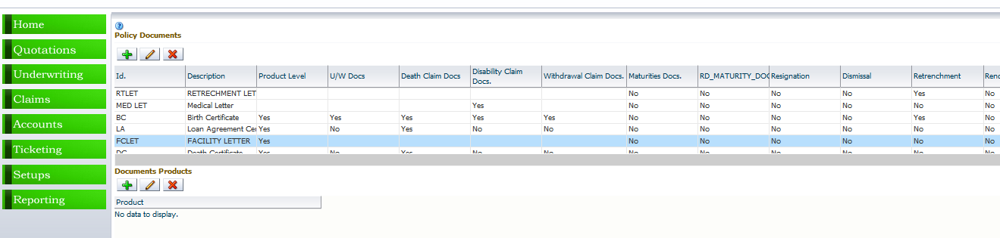

1.  Click on the  add button at the policy documents section

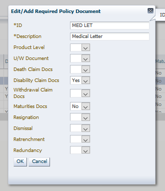

-   ID - Document short description
    -   Description- Full Name of the document
    -   Product Level - Whether applicable at a product level Y/N
    -   U/W Document - Whether applicable at underwriting
    -   Death Claim Docs - Whether applicable at Death claims
    -   Disability Claim Docs - Whether applicable at Disability claims
1.  Click on Ok to save
2.  If product level is Yes, click on add button at documents Products. The screen below appears

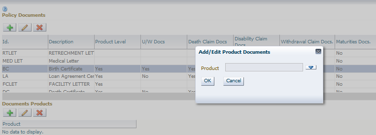

1.  Select the product, click ok to save

## Financial Account types

The system shall allow mapping of accounts that are updated in the finance system on processing and authorization of claims transactions in the Group life system. The accounts can be provided per product to cater for the reporting format in Finance.

-   **Disability/Death Claim**
    -   CLAIM PAYMENT: -Accounts updated when a claim is authorized for payment but prior to the cheque being issued
    -   REINSURANCE PREMIUM): -Accounts updated when a claim is processed and recoveries raised to the reinsurer
    -   PREMIUM RECOVERY: -Accounts updated when a claim is processed and outstanding premium is recovered from claim amounts
1.  Select **Transactions types** link from the **Accounts setups** sub menu of the **setups** menu

## 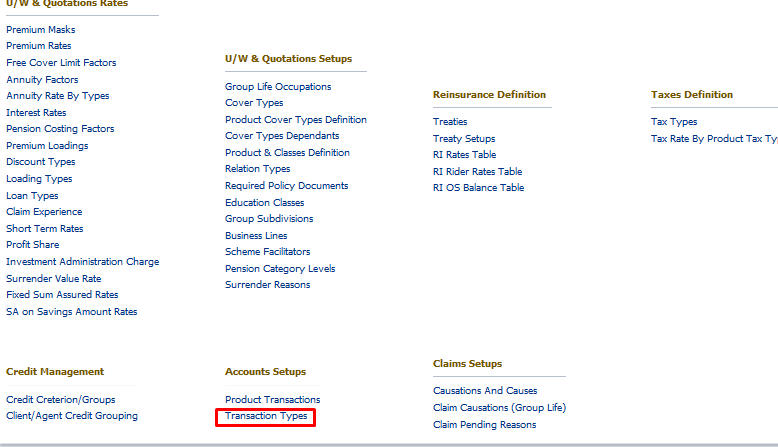

1.  For transactions whose account are not product specific, highlight the transaction and click on edit. The screen below opens

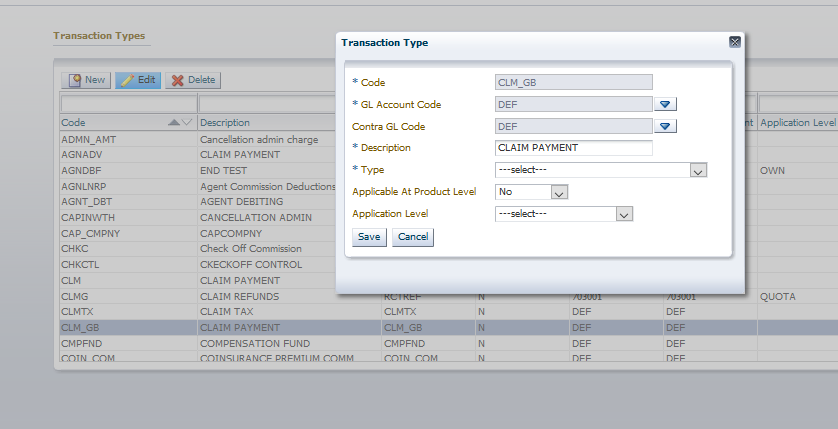

Click on the GL Account code list of values to select the account & Contra GL code if it applies

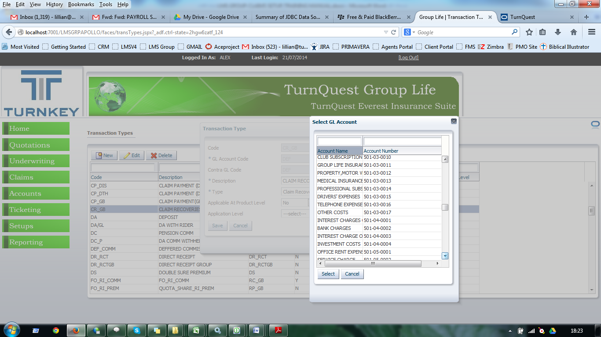

1.  For transactions whose account are product specific, click on **Product Transactions link**

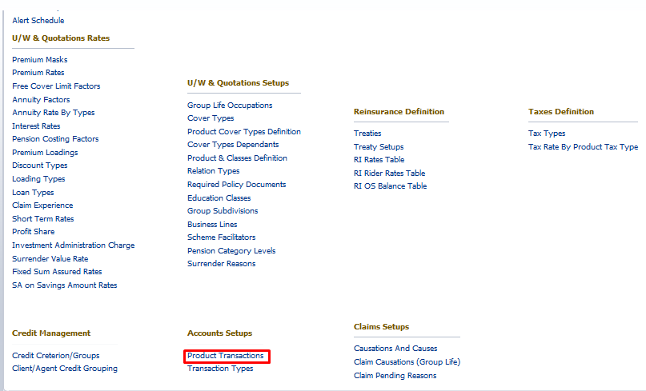

The screen below appears, highlight the product click on the  add button

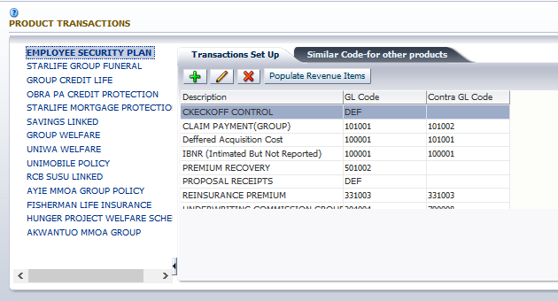

The screen below opens

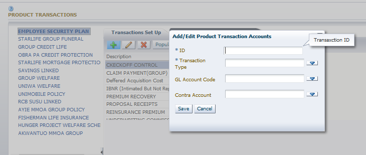

Select the transaction Types, applicable to the product claims and attach the account codes
